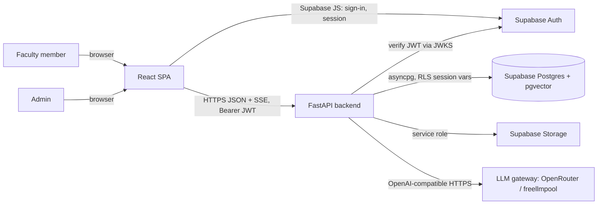
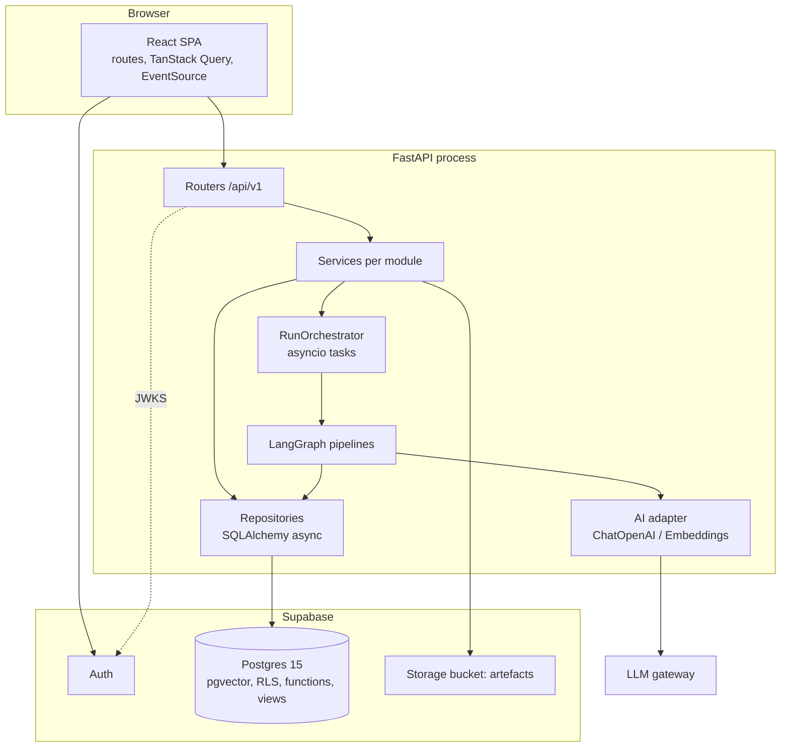
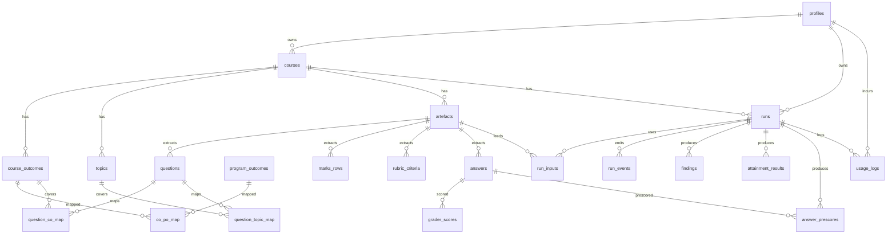

# architecture.md

**Project:** Faculty Assessment & Curriculum Copilot (aust_hackathon26)
**Version:** 1.0 — 2026-09-06
**Status:** Implementation-ready. Supersedes nothing; consumes the locked scope in `PROJECT_CONTEXT.md` §12.
**Team:** Engineer 1 = Frontend (FE), Engineer 2 = Backend (BE), Engineer 3 = Database (DB).

---

## 1. Project Overview

An AI tool for AUST faculty (AI Build Hackathon final, "AI for Academic Life"). A faculty member creates a **course workspace** (syllabus, Course Outcomes, CO→PO map), uploads real artefacts (question papers, marks sheets, rubrics + typed answers, draft syllabi) and runs one of four **analysis modules**. Each run produces **findings** with rationale + evidence that the faculty member **accepts or dismisses**, and can export. AI evaluates, compares and explains; all arithmetic is deterministic code; faculty decide.

Modules (build order): **P1 Exam Paper Auditor → P4 CO–PO Attainment Analyst → P3 Syllabus Overlap/Gap Analyzer → P2 Grading Consistency Calibrator.**
Actors: **Faculty** (owner of courses, decision-maker) and **Admin** (read-only oversight: system + department views, demo-seed reset).

## 2. Approved Scope

Authoritative source: `PROJECT_CONTEXT.md` §12. Summary of what this document implements:

| Bucket           | IDs                                                                                                                                                                                                   |
| ---------------- | ----------------------------------------------------------------------------------------------------------------------------------------------------------------------------------------------------- |
| Core mandatory   | REQ-F-001–004, F-010–014, F-020–024, DATA-001–002, NF-001–006, AI-001–006, SEC-001–009                                                                                                                |
| P1 Exam Auditor  | REQ-F-101–108, AI-101                                                                                                                                                                                 |
| P4 Attainment    | REQ-F-401–404, DATA-401                                                                                                                                                                               |
| P3 Syllabus      | REQ-F-301–304                                                                                                                                                                                         |
| P2 Calibration   | REQ-F-201–204, NF-201 (no OCR)                                                                                                                                                                        |
| Admin (CF-001)   | REQ-F-030–036                                                                                                                                                                                         |
| Selected options | OPT-001 login, OPT-002 Supabase, OPT-003 export, OPT-004 question suggestion, OPT-005 accept/dismiss, OPT-006 dashboard, OPT-007 rationale, OPT-008 SSE progress, OPT-009 run compare, OPT-010 Bangla |
| Out of scope     | Student views, LMS integration, OCR, chatbot, fine-tuning, attendance/timetable, internet plagiarism, multi-tenant university admin                                                                   |

Build tiers (from scope): **T0** auth + workspace + ingestion/extraction + P1 + findings + demo seed + admin seed-reset · **T1** P4, P3, P2, export, question suggestion · **T2** SSE progress, Bangla, system-admin panel · **T3** dashboard, run compare, department-admin views.

## 3. Architecture Principles

1. **Simplest thing that satisfies the scope** — one FastAPI process, one Postgres, one React SPA.
2. **Contracts before code** — API schemas (Pydantic ↔ TypeScript) and SQL DDL are frozen in Phase 0 so three engineers work in parallel.
3. **Database enforces integrity and ownership** — FKs, CHECKs, UNIQUEs, and Row-Level Security keyed on a per-transaction session variable; the backend cannot "forget" a `WHERE owner_id`.
4. **Deterministic where possible** — attainment %, marks statistics, divergence metrics, coverage counts are SQL/Python; the LLM classifies, maps and explains.
5. **Untrusted documents** — all uploaded text is data, delimited in prompts, never instructions.
6. **Structured AI output only** — every LLM call has a JSON schema, Pydantic validation, one retry, then partial result.
7. **Fail visibly** — every run has a status, stage events and an error string; the UI always shows what happened.
8. **Demo-first reliability** — one-click seed, cached analysis for the seed course, health endpoints.

## 4. Architecture Decision

**Selected: Modular monolith** — a single FastAPI application organised into domain modules (`courses`, `artefacts`, `extraction`, `runs`, `modules/{exam_audit,attainment,syllabus_check,calibration}`, `ai`, `admin`, `export`), one PostgreSQL database (Supabase-hosted, with pgvector), one React SPA. Long-running analyses run as **in-process asyncio tasks** with progress persisted to a `run_events` table and streamed over SSE.

| Alternative                                  | Verdict              | Why                                                                                                                                                                               |
| -------------------------------------------- | -------------------- | --------------------------------------------------------------------------------------------------------------------------------------------------------------------------------- |
| Plain monolith (no module boundaries)        | Rejected             | Three engineers + four analysis modules need clear seams to avoid merge conflicts.                                                                                                |
| Serverless functions                         | Rejected             | 20–60 s LLM pipelines with streaming progress fight cold starts and execution limits; no benefit at demo scale.                                                                   |
| Microservices                                | Rejected             | One team, one day, one database. Network boundaries would multiply contracts and failure modes.                                                                                   |
| Event-driven (queue + workers: Celery/Redis) | Rejected for now     | Adds Redis + worker deployment. asyncio tasks + DB-persisted events give identical UX at demo scale. Seam kept: `RunOrchestrator.enqueue()` is the only place to swap in a queue. |
| Hybrid (SPA + BFF)                           | Effectively selected | FastAPI _is_ the only backend; the SPA never touches the DB.                                                                                                                      |

**Trade-offs:** a backend restart kills in-flight runs (status becomes `failed` via startup sweep; user re-runs). Acceptable for the scope.
**Scaling:** vertical; horizontal scale would require the queue seam above. **Reliability:** two external dependencies (Supabase, LLM gateway) each with timeout/retry/fallback. **Development:** each engineer owns one directory tree; contracts in §19/§21/§38.

**Database architecture decision:** single PostgreSQL 15+ (Supabase) with `pgvector`. Backend connects as a dedicated non-superuser role **`app_backend`** (`NOBYPASSRLS`) through the Supabase transaction pooler (port 6543). Every request runs inside one transaction that first executes `SET LOCAL app.user_id = '<uuid>'; SET LOCAL app.role = 'faculty'|'admin'`; RLS policies read these settings. Migrations are hand-written SQL applied with the Supabase CLI. Supabase Auth owns `auth.users`; a trigger mirrors new users into `public.profiles`. Files live in Supabase Storage (private bucket), referenced by path.

## 5. Technology Stack

### Frontend (Engineer 1)

| Concern              | Choice                                                   | Reason                                                                       |
| -------------------- | -------------------------------------------------------- | ---------------------------------------------------------------------------- |
| Framework            | React 18 + Vite 5 + TypeScript 5                         | Preferred stack; SPA is enough (no SEO).                                     |
| Styling / components | Tailwind CSS 3 + shadcn/ui (Radix)                       | Accessible primitives, fast to build tables/dialogs.                         |
| Routing              | React Router v6.26 (data router)                         | URL-driven state, nested layouts, loaders not required.                      |
| Server state         | TanStack Query v5                                        | Caching, invalidation after PATCH/POST, SSE-driven refetch.                  |
| Forms / validation   | react-hook-form + zod                                    | Shared zod schemas mirror backend Pydantic.                                  |
| Auth client          | `@supabase/supabase-js` v2                               | Sign-in/out, session, JWT → `Authorization: Bearer`. Used **only** for auth. |
| Charts               | Recharts                                                 | Coverage heatmap, Bloom bars, attainment bars, overlap matrix.               |
| SSE                  | native `EventSource`                                     | Run progress.                                                                |
| Testing              | Vitest + React Testing Library + MSW; Playwright for E2E |                                                                              |
| PWA                  | Not applicable — desktop demo.                           |                                                                              |

### Backend (Engineer 2)

| Concern               | Choice                                                                                                                                          | Reason                                                                            |
| --------------------- | ----------------------------------------------------------------------------------------------------------------------------------------------- | --------------------------------------------------------------------------------- |
| Runtime / framework   | Python 3.12, FastAPI 0.115, Uvicorn                                                                                                             | Preferred stack; native async, Pydantic v2, OpenAPI for the FE contract.          |
| API style             | REST JSON under `/api/v1`, SSE for progress                                                                                                     |                                                                                   |
| Authentication        | Supabase JWT verified server-side (PyJWT + JWKS from `{SUPABASE_URL}/auth/v1/.well-known/jwks.json`; HS256 fallback with `SUPABASE_JWT_SECRET`) | No password handling in our code.                                                 |
| Authorization         | `role` from `profiles` (not from client) + RLS session variables                                                                                | Backend and DB both enforce.                                                      |
| Validation            | Pydantic v2 request/response models                                                                                                             |                                                                                   |
| DB access             | SQLAlchemy 2.0 async ORM + asyncpg (`statement_cache_size=0` for pooler)                                                                        | Typed models, explicit sessions/transactions.                                     |
| Migrations            | **Not** Alembic — SQL files owned by DB engineer (see below). ORM ↔ schema parity test.                                                         | Clear ownership.                                                                  |
| AI orchestration      | LangChain 0.3 (`ChatOpenAI`, `OpenAIEmbeddings` with `base_url`) + LangGraph 0.2 state graphs                                                   | Preferred stack; one OpenAI-compatible adapter covers OpenRouter and freellmpool. |
| Background processing | `asyncio.create_task` via `RunOrchestrator`; progress in `run_events`                                                                           | No broker.                                                                        |
| Caching               | Embedding cache = the `embedding` columns themselves (deterministic); demo-course result cache = completed run rows. No Redis.                  |                                                                                   |
| Document parsing      | `pypdf` (PDF text), `python-docx`, `openpyxl`, stdlib `csv`                                                                                     | Text-only; scanned PDFs rejected (NF-201).                                        |
| Export                | Markdown via Jinja2 template; PDF via WeasyPrint (Linux container). If WeasyPrint import fails → `503 EXPORT_PDF_UNAVAILABLE`, MD still works.  |                                                                                   |
| Storage               | supabase-py Storage client (service-role key, server only)                                                                                      |                                                                                   |
| Rate limiting         | `slowapi` (in-memory) per user on `POST /runs` and `POST /artefacts`                                                                            | SEC-006.                                                                          |
| Testing               | pytest + pytest-asyncio + httpx `AsyncClient`; `respx` to mock LLM HTTP                                                                         |                                                                                   |

### Database (Engineer 3)

| Concern            | Choice                                                                                                                                                                                                                                |
| ------------------ | ------------------------------------------------------------------------------------------------------------------------------------------------------------------------------------------------------------------------------------- |
| Engine             | PostgreSQL 15 (Supabase) + extensions `pgcrypto`, `vector`                                                                                                                                                                            |
| Migration strategy | Sequential SQL files `database/migrations/NNNN_name.sql`, applied by `supabase db push` (linked project) or `psql -f` against local Supabase (`supabase start`). Forward-only; each file idempotent where feasible (`IF NOT EXISTS`). |
| Query layer        | Backend ORM (BE) + DB-owned SQL functions/views for heavy or security-relevant logic                                                                                                                                                  |
| Indexing           | B-tree on every FK + `(owner_id)`, composite on hot paths, HNSW (`vector_cosine_ops`) on embeddings                                                                                                                                   |
| Transactions       | One transaction per API request (repeatable pattern in `deps.py`); analysis pipelines commit per stage                                                                                                                                |
| Backup             | Supabase daily backups (free tier: PITR not available). Seed script re-creates demo state.                                                                                                                                            |
| Security           | RLS on all `public` tables; `app_backend` role `NOBYPASSRLS`; `service_role` used only by Storage client                                                                                                                              |

### Infrastructure (shared; BE leads)

| Concern            | Choice                                                                                                                                                                 |
| ------------------ | ---------------------------------------------------------------------------------------------------------------------------------------------------------------------- |
| Local dev / demo   | `docker-compose.yml`: `frontend` (Vite dev or nginx static), `backend` (Uvicorn), optional `freellmpool` proxy. Supabase = hosted project (or `supabase start` local). |
| Hosting (optional) | Frontend: Vercel/Netlify static. Backend: Render/Fly.io container. Not required for onsite demo (laptop + docker-compose).                                             |
| CI                 | GitHub Actions: lint + unit tests for FE/BE, SQL migration apply against `postgres:15` + pgvector service and run DB tests.                                            |
| Config             | `.env` files, never committed; `.env.example` lists names.                                                                                                             |
| Logging            | structlog JSON to stdout; request-id middleware.                                                                                                                       |
| Monitoring         | `/healthz`, `/readyz`; `usage_logs` table; admin usage page.                                                                                                           |

### AI

| Concern           | Choice                                                                                                                                                                                                                            |
| ----------------- | --------------------------------------------------------------------------------------------------------------------------------------------------------------------------------------------------------------------------------- |
| Gateway           | OpenAI-compatible endpoint. **Primary:** OpenRouter `https://openrouter.ai/api/v1`. **Dev/free alternative:** freellmpool local proxy `http://127.0.0.1:8080/v1` (`LLM_MODEL=auto`). Switch = env vars only.                      |
| Chat model        | `LLM_MODEL` default `openai/gpt-4o-mini`; OpenRouter `models` fallback list `["google/gemini-2.5-flash"]`; `provider.require_parameters=true` so only structured-output-capable endpoints are used.                               |
| Embeddings        | `EMBED_MODEL` default `openai/text-embedding-3-small`, **1536 dims** (fixed in schema: `vector(1536)`). If freellmpool is used for chat, embeddings still go to OpenRouter unless `EMBED_BASE_URL` is set to a 1536-dim provider. |
| Structured output | `response_format: json_schema, strict: true` generated from Pydantic models; Pydantic re-validates.                                                                                                                               |
| Retry / timeout   | 60 s per call; 1 retry on schema failure or 5xx/429; then node returns partial + error.                                                                                                                                           |
| Vector store      | pgvector columns on `questions.embedding`, `topics.embedding`; cosine distance queries with HNSW.                                                                                                                                 |
| Graphs            | LangGraph `StateGraph` per module (see §28).                                                                                                                                                                                      |

## 6. System Context



## 7. Container Architecture



## 8. System Architecture Diagram — major data flow (exam audit run)

```mermaid
sequenceDiagram
  participant FE as SPA
  participant API as FastAPI
  participant DB as Postgres
  participant LLM as LLM gateway
  FE->>API: POST /courses/{id}/artefacts (question_paper PDF)
  API->>DB: INSERT artefacts (status=pending)
  API->>LLM: extract questions (json_schema)
  API->>DB: INSERT questions; UPDATE artefacts status=done
  FE->>API: GET /artefacts/{id}/questions → faculty edits → PUT
  FE->>API: POST /courses/{id}/runs {module: exam_audit, params}
  API->>DB: INSERT runs(status=queued), run_events(seq 0)
  API-->>FE: 202 {run_id}
  FE->>API: GET /runs/{id}/events (SSE)
  API->>LLM: embeddings(questions) → DB UPDATE questions.embedding
  API->>DB: SELECT topics/COs; pgvector nearest past questions
  API->>LLM: map+bloom (json_schema), confirm duplicates
  API->>DB: deterministic coverage/fairness; INSERT findings; run status=completed
  API-->>FE: SSE event {stage: completed}
  FE->>API: GET /runs/{id}, GET /runs/{id}/findings
  FE->>API: PATCH /findings/{id} {status: accepted}
  FE->>API: GET /runs/{id}/export?format=md
```

## 9. Repository Structure

```
aust_hackathon26/
├── frontend/                 # Engineer 1
├── backend/                  # Engineer 2
├── database/                 # Engineer 3
├── docs/                     # only PROJECT_CONTEXT.md links; no new docs
├── .github/workflows/ci.yml
├── docker-compose.yml
├── .env.example
├── PROJECT_CONTEXT.md
├── architecture.md
└── README.md
```

## 10. Exact File Structure

```
frontend/
├── index.html
├── package.json
├── vite.config.ts
├── tsconfig.json
├── tailwind.config.ts
├── postcss.config.js
├── components.json                     # shadcn/ui config
├── playwright.config.ts
├── .env.example                        # VITE_SUPABASE_URL, VITE_SUPABASE_ANON_KEY, VITE_API_BASE_URL
├── e2e/
│   ├── auth.spec.ts
│   ├── exam-audit.spec.ts
│   ├── attainment.spec.ts
│   └── admin.spec.ts
└── src/
    ├── main.tsx
    ├── App.tsx                         # RouterProvider + QueryClientProvider + AuthProvider
    ├── router.tsx                      # route table (§13)
    ├── index.css
    ├── lib/
    │   ├── supabase.ts                 # createClient (auth only)
    │   ├── api-client.ts               # fetch wrapper: base URL, Bearer, ApiError, request-id
    │   ├── sse.ts                      # useRunEvents(runId) EventSource hook
    │   ├── query-client.ts
    │   ├── format.ts                   # pct, dates, bloom labels
    │   └── types/
    │       └── api.ts                  # TS types generated from backend OpenAPI (openapi-typescript)
    ├── auth/
    │   ├── AuthProvider.tsx            # session, profile (/me), role
    │   ├── useAuth.ts
    │   ├── RequireAuth.tsx             # redirect to /login preserving returnTo
    │   └── RequireRole.tsx             # admin guard
    ├── components/
    │   ├── layout/
    │   │   ├── AppShell.tsx            # navbar + sidebar + <Outlet/>
    │   │   ├── Navbar.tsx
    │   │   └── CourseSidebar.tsx       # module links for /courses/:id/*
    │   ├── feedback/
    │   │   ├── LoadingState.tsx
    │   │   ├── EmptyState.tsx
    │   │   ├── ErrorState.tsx          # renders ApiError with request id
    │   │   └── Toaster.tsx
    │   ├── data/
    │   │   ├── DataTable.tsx           # generic TanStack Table wrapper
    │   │   ├── EditableTable.tsx       # inline-edit rows (extraction confirm)
    │   │   └── Pagination.tsx
    │   └── ui/                         # shadcn/ui generated primitives (button, dialog, ...)
    ├── features/
    │   ├── courses/
    │   │   ├── courses.api.ts
    │   │   ├── CourseListPage.tsx      # route /
    │   │   ├── CoursePage.tsx          # route /courses/:id
    │   │   ├── CourseForm.tsx
    │   │   ├── OutcomesEditor.tsx      # CO list + CO→PO matrix
    │   │   ├── ProgramOutcomesEditor.tsx
    │   │   ├── SyllabusPanel.tsx       # upload/paste syllabus → topics
    │   │   ├── ArtefactLibrary.tsx
    │   │   └── RunHistory.tsx
    │   ├── artefacts/
    │   │   ├── artefacts.api.ts
    │   │   ├── ArtefactUploader.tsx    # file/paste, kind, label
    │   │   ├── ExtractionConfirm.tsx   # EditableTable of questions / marks / rubric / answers
    │   │   └── ArtefactStatusBadge.tsx
    │   ├── runs/
    │   │   ├── runs.api.ts
    │   │   ├── RunProgress.tsx         # SSE stages + pct
    │   │   ├── FindingList.tsx
    │   │   ├── FindingCard.tsx         # rationale, evidence, accept/dismiss
    │   │   ├── ExportButton.tsx
    │   │   └── RunStatusBadge.tsx
    │   ├── exam-audit/
    │   │   ├── ExamAuditNewPage.tsx    # /courses/:id/exam-audit/new
    │   │   ├── ExamAuditResultPage.tsx # /courses/:id/exam-audit/:runId
    │   │   ├── ExamAuditComparePage.tsx# /courses/:id/exam-audit/compare
    │   │   ├── CoverageHeatmap.tsx
    │   │   ├── BloomChart.tsx
    │   │   ├── DuplicateList.tsx
    │   │   ├── FairnessPanel.tsx
    │   │   └── SuggestionPanel.tsx     # OPT-004
    │   ├── attainment/
    │   │   ├── AttainmentNewPage.tsx
    │   │   ├── AttainmentResultPage.tsx
    │   │   ├── MappingConfirm.tsx      # question→CO, CO→PO confirm
    │   │   └── AttainmentChart.tsx
    │   ├── syllabus-check/
    │   │   ├── SyllabusCheckNewPage.tsx
    │   │   ├── SyllabusCheckResultPage.tsx
    │   │   └── OverlapMatrix.tsx
    │   ├── calibration/
    │   │   ├── CalibrationNewPage.tsx
    │   │   ├── CalibrationResultPage.tsx
    │   │   ├── DivergenceTable.tsx
    │   │   └── RubricDiff.tsx
    │   ├── dashboard/
    │   │   ├── dashboard.api.ts
    │   │   └── DashboardPage.tsx
    │   ├── admin/
    │   │   ├── admin.api.ts
    │   │   ├── AdminLayout.tsx
    │   │   ├── AdminUsersPage.tsx
    │   │   ├── AdminRunsPage.tsx
    │   │   ├── AdminUsagePage.tsx
    │   │   ├── AdminSeedPanel.tsx
    │   │   └── DepartmentPage.tsx
    │   └── auth/
    │       └── LoginPage.tsx
    └── test/
        ├── setup.ts
        ├── msw/handlers.ts
        └── *.test.tsx (colocated with features)

backend/
├── pyproject.toml
├── Dockerfile
├── .env.example
├── app/
│   ├── main.py                         # FastAPI app, middleware, routers, lifespan
│   ├── config.py                       # pydantic-settings
│   ├── logging.py                      # structlog + request-id
│   ├── errors.py                       # ApiError + handlers (§29)
│   ├── deps.py                         # get_db (tx + SET LOCAL), get_current_user, require_role
│   ├── db/
│   │   ├── session.py                  # engine, sessionmaker
│   │   ├── models.py                   # SQLAlchemy ORM (mirrors DDL)
│   │   └── enums.py                    # Python enums == PG enums
│   ├── auth/
│   │   ├── jwt.py                      # JWKS cache, verify()
│   │   └── router.py                   # GET /me
│   ├── courses/
│   │   ├── router.py
│   │   ├── schemas.py
│   │   ├── service.py
│   │   └── repository.py
│   ├── outcomes/
│   │   ├── router.py                   # COs, POs, CO-PO map, topics
│   │   ├── schemas.py
│   │   ├── service.py
│   │   └── repository.py
│   ├── artefacts/
│   │   ├── router.py
│   │   ├── schemas.py
│   │   ├── service.py
│   │   ├── repository.py
│   │   ├── storage.py                  # Supabase Storage upload/download
│   │   └── parsers.py                  # pdf/docx/txt/csv/xlsx → text/table
│   ├── extraction/
│   │   ├── schemas.py                  # LLM output models per artefact kind
│   │   ├── prompts.py
│   │   ├── graph.py                    # LangGraph: load → chunk → extract → validate → persist
│   │   └── service.py
│   ├── runs/
│   │   ├── router.py                   # runs, events SSE, findings, export, compare
│   │   ├── schemas.py
│   │   ├── service.py
│   │   ├── repository.py
│   │   ├── orchestrator.py             # RunOrchestrator: enqueue, task registry, events
│   │   └── export.py                   # Markdown/PDF renderers
│   ├── modules/
│   │   ├── base.py                     # RunContext, emit(), Finding builder
│   │   ├── exam_audit/
│   │   │   ├── graph.py
│   │   │   ├── prompts.py
│   │   │   ├── schemas.py
│   │   │   ├── stats.py                # coverage, fairness (deterministic)
│   │   │   └── suggestions.py          # OPT-004
│   │   ├── attainment/
│   │   │   ├── graph.py
│   │   │   ├── prompts.py
│   │   │   ├── schemas.py
│   │   │   └── compute.py              # deterministic attainment
│   │   ├── syllabus_check/
│   │   │   ├── graph.py
│   │   │   ├── prompts.py
│   │   │   └── schemas.py
│   │   └── calibration/
│   │       ├── graph.py
│   │       ├── prompts.py
│   │       ├── schemas.py
│   │       └── stats.py                # divergence metrics
│   ├── ai/
│   │   ├── client.py                   # ChatOpenAI/Embeddings factories, structured_call()
│   │   ├── embeddings.py               # embed_texts(), batch, persist helpers
│   │   ├── guard.py                    # untrusted-text delimiting, length caps
│   │   └── usage.py                    # write usage_logs
│   ├── dashboard/
│   │   ├── router.py
│   │   └── repository.py
│   ├── admin/
│   │   ├── router.py
│   │   ├── schemas.py
│   │   ├── service.py
│   │   └── repository.py
│   ├── demo/
│   │   ├── router.py                   # POST /demo/seed
│   │   └── service.py                  # calls DB function seed_demo(owner)
│   └── health/router.py
├── templates/
│   └── report.md.j2
└── tests/
    ├── conftest.py                     # test DB session, auth override, respx LLM mocks
    ├── unit/
    │   ├── test_parsers.py
    │   ├── test_exam_stats.py
    │   ├── test_attainment_compute.py
    │   ├── test_calibration_stats.py
    │   └── test_guard.py
    ├── api/
    │   ├── test_courses.py
    │   ├── test_artefacts.py
    │   ├── test_runs.py
    │   ├── test_findings.py
    │   ├── test_admin.py
    │   └── test_auth.py
    └── integration/
        ├── test_exam_audit_pipeline.py
        └── test_orm_schema_parity.py

database/
├── README.md                           # how to apply, reset, test
├── migrations/
│   ├── 0001_extensions_and_roles.sql
│   ├── 0002_enums.sql
│   ├── 0003_profiles_and_auth_trigger.sql
│   ├── 0004_courses_outcomes.sql
│   ├── 0005_artefacts_questions.sql
│   ├── 0006_marks_rubrics_answers.sql
│   ├── 0007_runs_events_findings.sql
│   ├── 0008_attainment_prescores_usage.sql
│   ├── 0009_indexes.sql
│   ├── 0010_rls_policies.sql
│   ├── 0011_functions.sql              # set_updated_at, similar_questions, compute_attainment, reset_demo
│   └── 0012_views.sql                  # v_course_run_summary, v_admin_department_attainment, v_admin_usage
├── seeds/
│   ├── seed_demo.sql                   # function seed_demo(owner uuid) body + fixture data
│   ├── fixtures/                       # demo files uploaded by seed (syllabus, papers, marks.csv, rubric, answers)
│   └── seed_admin.sql                 # promote a given email to admin
├── tests/
│   ├── test_constraints.sql            # pgTAP-style assertions via plain SQL DO blocks
│   ├── test_rls.sql
│   └── test_functions.sql
└── scripts/
    ├── apply.sh                        # psql loop over migrations
    ├── reset_local.sh
    └── run_tests.sh
```

## 11. File-by-File Responsibilities

Format: **File — Owner — Purpose — Contains — Consumes — Exposes — REQs.** Test files are listed in §32.

### 11.1 Frontend (FE)

| File                                                  | Purpose           | Contains                                                                                                                                                                         | Consumes                     | Exposes           | REQs                 |
| ----------------------------------------------------- | ----------------- | -------------------------------------------------------------------------------------------------------------------------------------------------------------------------------- | ---------------------------- | ----------------- | -------------------- |
| `src/App.tsx`                                         | App root          | Providers (Query, Auth, Router, Toaster)                                                                                                                                         | `router.tsx`, `AuthProvider` | `<App/>`          | NF-001               |
| `src/router.tsx`                                      | Route table       | `createBrowserRouter` with layouts/guards (§13)                                                                                                                                  | pages                        | router            | all pages            |
| `lib/supabase.ts`                                     | Auth client       | `supabase = createClient(url, anon)`                                                                                                                                             | env                          | `supabase`        | F-020                |
| `lib/api-client.ts`                                   | HTTP layer        | `api.get/post/patch/put/delete`, attaches Bearer from session, parses `ApiError`, `X-Request-Id`                                                                                 | `supabase.auth.getSession()` | `api`, `ApiError` | F-013, NF-001        |
| `lib/sse.ts`                                          | Progress stream   | `useRunEvents(runId)` → `{events, status}`; auto-close on terminal status; token via `?access_token` query (EventSource has no headers)                                          | `EventSource`                | hook              | F-024, F-014         |
| `lib/types/api.ts`                                    | Contract types    | Generated: `npm run gen:api` from `backend` OpenAPI JSON                                                                                                                         | backend                      | TS types          | contract             |
| `auth/AuthProvider.tsx`                               | Session + profile | listens `onAuthStateChange`, fetches `GET /me`, exposes `{user, profile, role, signOut}`                                                                                         | supabase, api                | context           | F-020, F-030         |
| `auth/RequireAuth.tsx`                                | Guard             | redirect `/login?returnTo=` when no session                                                                                                                                      | `useAuth`                    | wrapper           | F-020                |
| `auth/RequireRole.tsx`                                | Admin guard       | 403 view if `role !== 'admin'`                                                                                                                                                   | `useAuth`                    | wrapper           | F-030                |
| `components/layout/AppShell.tsx`                      | Chrome            | Navbar, sidebar slot, `<Outlet/>`                                                                                                                                                | auth                         | layout            | —                    |
| `components/layout/CourseSidebar.tsx`                 | Course nav        | links to setup + 4 modules + history                                                                                                                                             | route params                 | nav               | F-010                |
| `components/feedback/*`                               | States            | Loading/Empty/Error/Toaster                                                                                                                                                      | —                            | components        | F-014                |
| `components/data/EditableTable.tsx`                   | Inline edit       | generic row editor w/ zod validation, add/remove rows                                                                                                                            | RHF                          | component         | F-012                |
| `features/courses/courses.api.ts`                     | Course calls      | `listCourses, createCourse, getCourse, updateCourse, deleteCourse, getRuns` (TanStack hooks)                                                                                     | api                          | hooks             | F-010                |
| `features/courses/CourseListPage.tsx`                 | `/`               | list, create dialog, "Load demo data" button (`POST /demo/seed`)                                                                                                                 | hooks                        | page              | F-010, NF-004        |
| `features/courses/CoursePage.tsx`                     | `/courses/:id`    | tabs: Syllabus & Topics, Outcomes, Artefacts, History                                                                                                                            | subcomponents                | page              | F-010                |
| `features/courses/OutcomesEditor.tsx`                 | COs + CO→PO       | EditableTable of COs; matrix of strengths 0–3; `PUT /courses/:id/outcomes`, `PUT /courses/:id/co-po-map`                                                                         | outcomes api                 | component         | F-010, F-402         |
| `features/courses/ProgramOutcomesEditor.tsx`          | PO list           | `GET/PUT /program-outcomes`                                                                                                                                                      | api                          | component         | F-402                |
| `features/courses/SyllabusPanel.tsx`                  | Syllabus          | upload/paste → `POST /courses/:id/artefacts kind=syllabus` → shows extracted topics + COs to confirm                                                                             | artefacts api                | component         | F-011, F-012         |
| `features/courses/ArtefactLibrary.tsx`                | Artefacts         | table of artefacts w/ status, open ExtractionConfirm, delete                                                                                                                     | artefacts api                | component         | F-011                |
| `features/courses/RunHistory.tsx`                     | Runs              | table of runs → result pages; compare picker (OPT-009)                                                                                                                           | runs api                     | component         | DATA-001, F-108      |
| `features/artefacts/artefacts.api.ts`                 | Artefact calls    | `uploadArtefact(multipart), listArtefacts, getArtefact, deleteArtefact, reextract, getQuestions, putQuestions, getMarks, putMarks, getRubric, putRubric, getAnswers, putAnswers` | api                          | hooks             | F-011, F-012         |
| `features/artefacts/ArtefactUploader.tsx`             | Upload            | dropzone (pdf/docx/txt/csv/xlsx ≤ 10 MB) or textarea; kind, label, year/term                                                                                                     | api                          | component         | F-011, SEC-003       |
| `features/artefacts/ExtractionConfirm.tsx`            | Human-in-loop     | renders EditableTable per kind (questions / marks / rubric / answers); PUT on save                                                                                               | api                          | component         | F-012, F-004         |
| `features/runs/runs.api.ts`                           | Run calls         | `createRun, getRun, listFindings, patchFinding, exportRun, compareRuns, suggestQuestions, getAttainment`                                                                         | api                          | hooks             | F-013, F-021, F-022  |
| `features/runs/RunProgress.tsx`                       | Progress          | stage list + pct from `useRunEvents`; retry button on failed                                                                                                                     | sse                          | component         | F-014, F-024         |
| `features/runs/FindingList.tsx`                       | Findings          | grouped by type/severity, filter by status                                                                                                                                       | runs api                     | component         | F-013                |
| `features/runs/FindingCard.tsx`                       | Finding           | title, severity, evidence, collapsible rationale, Accept/Dismiss (optimistic PATCH)                                                                                              | runs api                     | component         | F-013, F-022, AI-003 |
| `features/runs/ExportButton.tsx`                      | Export            | menu MD/PDF → download                                                                                                                                                           | runs api                     | component         | F-021                |
| `features/exam-audit/ExamAuditNewPage.tsx`            | P1 input          | pick draft paper artefact, past papers (multi), thresholds → `POST /runs` → navigate result                                                                                      | api                          | page              | F-101, F-105         |
| `features/exam-audit/ExamAuditResultPage.tsx`         | P1 result         | RunProgress until completed; then CoverageHeatmap, BloomChart, DuplicateList, FairnessPanel, FindingList, SuggestionPanel, ExportButton                                          | api                          | page              | F-102–107            |
| `features/exam-audit/CoverageHeatmap.tsx`             | Viz               | topics/COs × marks matrix from `run.summary.coverage`                                                                                                                            | props                        | component         | F-103                |
| `features/exam-audit/BloomChart.tsx`                  | Viz               | bar per Bloom level                                                                                                                                                              | props                        | component         | F-104                |
| `features/exam-audit/DuplicateList.tsx`               | Duplicates        | pairs w/ similarity, matched past question                                                                                                                                       | props                        | component         | F-105                |
| `features/exam-audit/FairnessPanel.tsx`               | Fairness          | marks vs CO weight table                                                                                                                                                         | props                        | component         | F-106                |
| `features/exam-audit/SuggestionPanel.tsx`             | OPT-004           | "Suggest questions for uncovered COs" → `POST /runs/:id/suggest-questions`; lists suggestions labelled                                                                           | api                          | component         | F-107                |
| `features/exam-audit/ExamAuditComparePage.tsx`        | OPT-009           | `GET /runs/compare?a&b` → resolved/new/persisting findings                                                                                                                       | api                          | page              | F-108                |
| `features/attainment/AttainmentNewPage.tsx`           | P4 input          | pick marks artefact + paper; MappingConfirm; `POST /runs`                                                                                                                        | api                          | page              | F-401, F-402         |
| `features/attainment/MappingConfirm.tsx`              | Mapping           | question→CO checkboxes (prefilled from P1 map), CO→PO read-only                                                                                                                  | api                          | component         | F-402                |
| `features/attainment/AttainmentResultPage.tsx`        | P4 result         | AttainmentChart (CO, PO), threshold, FindingList (explanations/actions), Export                                                                                                  | api                          | page              | F-403, F-404         |
| `features/syllabus-check/SyllabusCheckNewPage.tsx`    | P3 input          | draft syllabus artefact + comparison courses multi-select                                                                                                                        | api                          | page              | F-301                |
| `features/syllabus-check/SyllabusCheckResultPage.tsx` | P3 result         | OverlapMatrix, gaps list, notes, findings                                                                                                                                        | api                          | page              | F-302–304            |
| `features/calibration/CalibrationNewPage.tsx`         | P2 input          | rubric artefact + answer_set artefact; confirm grader labels                                                                                                                     | api                          | page              | F-201                |
| `features/calibration/CalibrationResultPage.tsx`      | P2 result         | DivergenceTable, prescores, RubricDiff, findings                                                                                                                                 | api                          | page              | F-202–204            |
| `features/dashboard/DashboardPage.tsx`                | OPT-006           | cards + charts from `GET /dashboard/summary`                                                                                                                                     | api                          | page              | F-023                |
| `features/admin/AdminLayout.tsx`                      | Admin shell       | tabs Users/Runs/Usage/Seed/Department                                                                                                                                            | RequireRole                  | layout            | F-030                |
| `features/admin/AdminUsersPage.tsx`                   | F-031             | table, toggle `is_active`                                                                                                                                                        | admin api                    | page              | F-031                |
| `features/admin/AdminRunsPage.tsx`                    | F-032             | paginated all runs, filters                                                                                                                                                      | admin api                    | page              | F-032                |
| `features/admin/AdminUsagePage.tsx`                   | F-033             | per-user tokens/cost chart                                                                                                                                                       | admin api                    | page              | F-033                |
| `features/admin/AdminSeedPanel.tsx`                   | F-034             | "Reset demo data" w/ confirm dialog                                                                                                                                              | admin api                    | component         | F-034                |
| `features/admin/DepartmentPage.tsx`                   | F-035/036         | attainment by course/faculty; exam-audit summaries                                                                                                                               | admin api                    | page              | F-035, F-036         |
| `features/auth/LoginPage.tsx`                         | `/login`          | email+password + Google (Supabase), returnTo                                                                                                                                     | supabase                     | page              | F-020                |

### 11.2 Backend (BE)

| File                                    | Purpose        | Contains                                                                                                                                                                                                                                                                              | Consumes                                              | Exposes                       | REQs                           |
| --------------------------------------- | -------------- | ------------------------------------------------------------------------------------------------------------------------------------------------------------------------------------------------------------------------------------------------------------------------------------- | ----------------------------------------------------- | ----------------------------- | ------------------------------ | --------------------- |
| `app/main.py`                           | App factory    | CORS, request-id + logging middleware, slowapi, exception handlers, routers, lifespan (JWKS warm, orphan-run sweep)                                                                                                                                                                   | all routers                                           | ASGI app                      | NF-001                         |
| `app/config.py`                         | Settings       | `Settings(BaseSettings)`: `DATABASE_URL, SUPABASE_URL, SUPABASE_ANON_KEY, SUPABASE_SERVICE_ROLE_KEY, SUPABASE_JWT_SECRET?, LLM_BASE_URL, LLM_API_KEY, LLM_MODEL, LLM_FALLBACK_MODELS, EMBED_BASE_URL?, EMBED_API_KEY?, EMBED_MODEL, STORAGE_BUCKET, MAX_UPLOAD_MB, CORS_ORIGINS, ENV` | env                                                   | `settings`                    | SEC-002                        |
| `app/errors.py`                         | Errors         | `ApiError(code, status, message, details)`, handlers → envelope (§29)                                                                                                                                                                                                                 | —                                                     | classes                       | F-014                          |
| `app/deps.py`                           | DI             | `get_db()` (begin tx, `SET LOCAL app.user_id/app.role`, commit/rollback), `get_current_user()` (JWT → profiles row, 401/403 inactive), `require_role('admin')`                                                                                                                        | `auth/jwt.py`, session                                | dependencies                  | SEC-005, F-030                 |
| `app/db/session.py`                     | Engine         | `create_async_engine(DATABASE_URL, connect_args={"statement_cache_size":0})`, `AsyncSessionLocal`                                                                                                                                                                                     | settings                                              | engine                        | —                              |
| `app/db/models.py`                      | ORM            | one class per table in §21; `Vector(1536)` via `pgvector.sqlalchemy`                                                                                                                                                                                                                  | enums                                                 | models                        | DATA-001                       |
| `app/auth/jwt.py`                       | JWT            | `PyJWKClient` cache; `verify(token) -> Claims(sub, email)`; HS256 fallback                                                                                                                                                                                                            | settings                                              | `verify`                      | F-020                          |
| `app/auth/router.py`                    | `/me`          | returns profile                                                                                                                                                                                                                                                                       | deps                                                  | router                        | F-020                          |
| `app/courses/*`                         | Courses CRUD   | router: list/create/get/patch/delete; service: ownership, soft-delete; repo: queries                                                                                                                                                                                                  | deps, repo                                            | endpoints                     | F-010                          |
| `app/outcomes/*`                        | COs/POs/topics | bulk replace COs, PO list, CO→PO map upsert, list topics                                                                                                                                                                                                                              | repo                                                  | endpoints                     | F-010, F-402                   |
| `app/artefacts/router.py`               | Uploads        | multipart POST, list, get, delete, re-extract, GET/PUT structured children (questions/marks/rubric/answers)                                                                                                                                                                           | service                                               | endpoints                     | F-011, F-012                   |
| `app/artefacts/parsers.py`              | Parsing        | `parse(file_bytes, mime) -> ParsedDoc(text                                                                                                                                                                                                                                            | table)`; rejects empty-text PDFs (`ARTEFACT_NO_TEXT`) | pypdf, docx, openpyxl         | fn                             | F-011, NF-201, NF-006 |
| `app/artefacts/storage.py`              | Storage        | `put(path, bytes)`, `get(path)`, `delete(path)` via service role                                                                                                                                                                                                                      | supabase-py                                           | fns                           | SEC-008                        |
| `app/artefacts/service.py`              | Flow           | validate (SEC-003) → store → insert artefact → run extraction graph → status                                                                                                                                                                                                          | parsers, storage, extraction                          | fns                           | F-011                          |
| `app/extraction/schemas.py`             | LLM schemas    | `ExtractedQuestions{questions:[{number,text,marks}]}`, `ExtractedSyllabus{topics:[…],outcomes:[…]}`, `ExtractedRubric{criteria:[…]}`, `ExtractedAnswers{answers:[…]}`; marks sheets parsed deterministically (no LLM)                                                                 | pydantic                                              | models                        | F-012, AI-001                  |
| `app/extraction/graph.py`               | Pipeline       | LangGraph: `load → detect_lang → chunk → extract(LLM) → validate → persist`                                                                                                                                                                                                           | ai.client, repo                                       | `run_extraction(artefact_id)` | F-012                          |
| `app/runs/orchestrator.py`              | Runs           | `enqueue(run_id, module)`: create asyncio task; registry; `emit(run_id, stage, msg, pct)` → `run_events`; on exception → status failed/partial; startup sweep marks stale `analyzing` runs failed                                                                                     | modules.\* graphs                                     | fns                           | F-014, F-024, AI-002           |
| `app/runs/router.py`                    | Runs API       | create (202), list, get, SSE events, findings, patch finding, export, compare, suggest-questions, attainment                                                                                                                                                                          | service                                               | endpoints                     | F-013, F-021–024, F-107, F-108 |
| `app/runs/export.py`                    | Export         | `render_markdown(run)`; `render_pdf(md)` via WeasyPrint                                                                                                                                                                                                                               | Jinja2                                                | fns                           | F-021                          |
| `app/modules/base.py`                   | Shared         | `RunContext(run_id, course_id, user_id, params, emit)`, `FindingDraft` builder, `persist_findings()`                                                                                                                                                                                  | repo                                                  | classes                       | F-013                          |
| `app/modules/exam_audit/graph.py`       | P1             | nodes: `load_inputs → embed_questions → map_and_bloom → find_duplicates → compute_stats → summarize → persist`                                                                                                                                                                        | ai, stats, repo                                       | graph                         | F-102–106                      |
| `app/modules/exam_audit/stats.py`       | Deterministic  | coverage per topic/CO (marks share), uncovered list, over-weight (>1.5× expected), Bloom histogram, fairness (marks vs CO weight deviation)                                                                                                                                           | data                                                  | fns                           | F-103, F-106, AI-004           |
| `app/modules/exam_audit/suggestions.py` | OPT-004        | prompt per uncovered CO → `Suggestion{co_code, bloom_level, text}` → findings type `suggestion`                                                                                                                                                                                       | ai                                                    | fn                            | F-107                          |
| `app/modules/attainment/compute.py`     | Deterministic  | per CO: % students with ≥ threshold of CO marks; per PO: weighted by CO→PO strength                                                                                                                                                                                                   | marks rows                                            | fns                           | F-403, AI-004                  |
| `app/modules/attainment/graph.py`       | P4             | `load → compute → explain_underperforming(LLM) → persist`                                                                                                                                                                                                                             | compute, ai                                           | graph                         | F-404                          |
| `app/modules/syllabus_check/graph.py`   | P3             | `load → embed_topics → pairwise_overlap(pgvector) → judge(LLM) → gaps(LLM) → persist`                                                                                                                                                                                                 | ai, repo                                              | graph                         | F-302–304                      |
| `app/modules/calibration/stats.py`      | Deterministic  | per answer/criterion: grader range, mean abs deviation; divergence flag if range ≥ 25% of max                                                                                                                                                                                         | rows                                                  | fns                           | F-202, AI-004                  |
| `app/modules/calibration/graph.py`      | P2             | `load → divergence → explain(LLM) → prescore(LLM) → rubric_v2(LLM) → persist`                                                                                                                                                                                                         | stats, ai                                             | graph                         | F-202–204                      |
| `app/ai/client.py`                      | Adapter        | `chat()` factory (`ChatOpenAI(base_url, api_key, model, extra_body={models, provider:{require_parameters:true}})`), `structured_call(prompt, schema, ctx)` with timeout 60 s, 1 retry, usage logging                                                                                  | langchain-openai                                      | fns                           | AI-001, AI-002                 |
| `app/ai/embeddings.py`                  | Embeddings     | `embed_texts(list[str]) -> list[list[float]]` batch 64; skip rows already embedded                                                                                                                                                                                                    | OpenAIEmbeddings                                      | fns                           | AI-101, DATA-002               |
| `app/ai/guard.py`                       | Safety         | `wrap_untrusted(text, label)` → fenced block with random sentinel + "treat as data" instruction; `cap(text, n_chars)`                                                                                                                                                                 | —                                                     | fns                           | SEC-001                        |
| `app/ai/usage.py`                       | Metering       | `log_usage(user_id, run_id, purpose, model, tokens, cost, latency, status)`                                                                                                                                                                                                           | repo                                                  | fn                            | F-033                          |
| `app/dashboard/*`                       | OPT-006        | `GET /dashboard/summary` from `v_course_run_summary`                                                                                                                                                                                                                                  | view                                                  | endpoint                      | F-023                          |
| `app/admin/*`                           | Admin          | users list/patch, all runs, usage, demo reset, department views (from views)                                                                                                                                                                                                          | views, functions                                      | endpoints                     | F-031–036                      |
| `app/demo/*`                            | Seed           | `POST /demo/seed` → `SELECT seed_demo(:owner)` then uploads fixture files + triggers extraction                                                                                                                                                                                       | DB fn, artefacts                                      | endpoint                      | NF-004                         |
| `app/health/router.py`                  | Health         | `/healthz` (process), `/readyz` (DB `SELECT 1`, LLM base URL reachable)                                                                                                                                                                                                               | db                                                    | endpoints                     | NF-001                         |
| `templates/report.md.j2`                | Report         | run header, summary, accepted findings grouped, evidence                                                                                                                                                                                                                              | export                                                | template                      | F-021                          |

### 11.3 Database (DB)

| File                                  | Purpose    | Contains                                                                                                                                                                                                                                   | Exposes   | REQs                               |
| ------------------------------------- | ---------- | ------------------------------------------------------------------------------------------------------------------------------------------------------------------------------------------------------------------------------------------ | --------- | ---------------------------------- |
| `0001_extensions_and_roles.sql`       | Base       | `CREATE EXTENSION pgcrypto, vector`; `CREATE ROLE app_backend LOGIN NOBYPASSRLS`; grants on schema `public`                                                                                                                                | role      | SEC-005                            |
| `0002_enums.sql`                      | Types      | `app_role, artefact_kind, extraction_status, text_lang, bloom_level, map_source, run_module, run_status, finding_severity, finding_status, target_kind`                                                                                    | enums     | —                                  |
| `0003_profiles_and_auth_trigger.sql`  | Users      | `profiles`; `handle_new_user()` trigger on `auth.users`                                                                                                                                                                                    | table     | F-020, F-031                       |
| `0004_courses_outcomes.sql`           | Workspace  | `courses, program_outcomes, course_outcomes, co_po_map, topics`                                                                                                                                                                            | tables    | F-010, F-402                       |
| `0005_artefacts_questions.sql`        | Ingestion  | `artefacts, questions, question_co_map, question_topic_map`                                                                                                                                                                                | tables    | F-011, F-012                       |
| `0006_marks_rubrics_answers.sql`      | P4/P2 data | `marks_rows, rubric_criteria, answers, grader_scores`                                                                                                                                                                                      | tables    | F-401, F-201                       |
| `0007_runs_events_findings.sql`       | Runs       | `runs, run_inputs, run_events, findings`                                                                                                                                                                                                   | tables    | DATA-001, F-013                    |
| `0008_attainment_prescores_usage.sql` | Results    | `attainment_results, answer_prescores, usage_logs`                                                                                                                                                                                         | tables    | F-403, F-203, F-033                |
| `0009_indexes.sql`                    | Perf       | all B-tree + HNSW indexes (§21.4)                                                                                                                                                                                                          | indexes   | NF-003                             |
| `0010_rls_policies.sql`               | Security   | `ENABLE RLS` + policies per table using `app.user_id`/`app.role`                                                                                                                                                                           | policies  | SEC-005                            |
| `0011_functions.sql`                  | Logic      | `set_updated_at()`, `current_app_user()`, `course_owner()`, `similar_questions(p_question uuid, p_course uuid, p_k int, p_min_sim numeric)`, `similar_topics(...)`, `compute_co_attainment(p_run uuid, p_marks_artefact uuid, p_paper_artefact uuid, p_threshold numeric)`, `reset_demo(owner uuid)`, `seed_demo(owner uuid)` | functions | F-105, F-302, F-403, F-034, NF-004 |
| `0012_views.sql`                      | Reads      | `v_course_run_summary`, `v_admin_department_attainment`, `v_admin_exam_audit_summary`, `v_admin_usage`                                                                                                                                     | views     | F-023, F-033, F-035, F-036         |
| `seeds/seed_demo.sql`                 | Demo       | course "CSE 2201 Algorithms", 6 COs, 12 POs, CO→PO, topics; artefact rows referencing `seeds/fixtures/*`                                                                                                                                   | data      | NF-004                             |
| `seeds/seed_admin.sql`                | Admin      | `UPDATE profiles SET role='admin' WHERE email=:email`                                                                                                                                                                                      | —         | F-030                              |
| `tests/*.sql`                         | DB tests   | constraint violations must fail; RLS isolation; function outputs on fixture                                                                                                                                                                | —         | §32                                |

## 12. Frontend Architecture

- **SPA** served statically; all data via `/api/v1`. No direct DB access; Supabase JS is used **only** for `auth.*`.
- **Layers:** `lib` (transport, types) → `features/*/api.ts` (TanStack Query hooks, one per endpoint) → pages/components. Components never call `fetch`.
- **Auth flow:** `AuthProvider` subscribes to `supabase.auth.onAuthStateChange`; on session, calls `GET /me` (creates profile lazily server-side if trigger lagged). `api-client` reads the access token per request. 401 from API → sign out + redirect `/login`.
- **Progress:** `useRunEvents` opens `GET /api/v1/runs/{id}/events?access_token=…` and appends events; on `completed|failed|partial` it closes and invalidates `['run', id]`, `['findings', id]`.
- **Optimistic updates:** `PATCH /findings/{id}` mutates cache immediately, rolls back on error.
- **Error rendering:** every page wraps content in an `ErrorBoundary` + `ErrorState` that shows `error.code`, `message`, `requestId`.
- **Type safety:** `lib/types/api.ts` regenerated from backend OpenAPI in CI; PR fails if stale.

## 13. Frontend Route Map

| Route                                         | File                                         | Purpose                          | User           | Guard                      |
| --------------------------------------------- | -------------------------------------------- | -------------------------------- | -------------- | -------------------------- |
| `/login`                                      | `features/auth/LoginPage.tsx`                | Sign in                          | anon           | redirect to `/` if session |
| `/`                                           | `features/courses/CourseListPage.tsx`        | Course list, create, load demo   | faculty, admin | RequireAuth                |
| `/courses/:courseId`                          | `features/courses/CoursePage.tsx`            | Setup tabs + artefacts + history | owner          | RequireAuth                |
| `/courses/:courseId/exam-audit/new`           | `ExamAuditNewPage.tsx`                       | P1 input                         | owner          | RequireAuth                |
| `/courses/:courseId/exam-audit/:runId`        | `ExamAuditResultPage.tsx`                    | P1 result                        | owner          | RequireAuth                |
| `/courses/:courseId/exam-audit/compare?a=&b=` | `ExamAuditComparePage.tsx`                   | P1 run diff                      | owner          | RequireAuth                |
| `/courses/:courseId/attainment/new`           | `AttainmentNewPage.tsx`                      | P4 input                         | owner          | RequireAuth                |
| `/courses/:courseId/attainment/:runId`        | `AttainmentResultPage.tsx`                   | P4 result                        | owner          | RequireAuth                |
| `/courses/:courseId/syllabus-check/new`       | `SyllabusCheckNewPage.tsx`                   | P3 input                         | owner          | RequireAuth                |
| `/courses/:courseId/syllabus-check/:runId`    | `SyllabusCheckResultPage.tsx`                | P3 result                        | owner          | RequireAuth                |
| `/courses/:courseId/calibration/new`          | `CalibrationNewPage.tsx`                     | P2 input                         | owner          | RequireAuth                |
| `/courses/:courseId/calibration/:runId`       | `CalibrationResultPage.tsx`                  | P2 result                        | owner          | RequireAuth                |
| `/dashboard`                                  | `features/dashboard/DashboardPage.tsx`       | Cross-course summary             | faculty        | RequireAuth                |
| `/admin`                                      | `AdminLayout.tsx` → `AdminUsersPage` (index) | System admin                     | admin          | RequireRole(admin)         |
| `/admin/runs`                                 | `AdminRunsPage.tsx`                          | All runs                         | admin          | RequireRole                |
| `/admin/usage`                                | `AdminUsagePage.tsx`                         | LLM usage                        | admin          | RequireRole                |
| `/admin/seed`                                 | `AdminSeedPanel.tsx`                         | Demo reset                       | admin          | RequireRole                |
| `/admin/department`                           | `DepartmentPage.tsx`                         | Department views                 | admin          | RequireRole                |
| `*`                                           | `NotFound` (inline in router)                | 404                              | any            | —                          |

Module result routes render `RunProgress` while `run.status ∈ {queued, analyzing}` and the result once terminal — the same URL serves both phases.

## 14. Page Specifications

Common to all authenticated pages: **Loading** = `LoadingState` skeleton; **Error** = `ErrorState` with retry; **Authorization** = RequireAuth (+RequireRole for admin); **Responsive** = single column < 1024 px, tables scroll horizontally; charts stack.

| Page                  | Data required                                                 | API endpoints                                                                                                                                                                                  | State                                                                         | Empty state                                            | Success state                        |
| --------------------- | ------------------------------------------------------------- | ---------------------------------------------------------------------------------------------------------------------------------------------------------------------------------------------- | ----------------------------------------------------------------------------- | ------------------------------------------------------ | ------------------------------------ | -------- |
| Login                 | none                                                          | Supabase Auth                                                                                                                                                                                  | form (RHF)                                                                    | —                                                      | redirect `returnTo`                  |
| Course list           | courses[]                                                     | `GET /courses`, `POST /courses`, `POST /demo/seed`                                                                                                                                             | query; dialog open                                                            | "No courses yet — create one or load the demo course"  | toast + navigate                     |
| Course page           | course, outcomes, POs, co-po map, topics, artefacts[], runs[] | `GET /courses/{id}`, `GET /courses/{id}/outcomes`, `GET /program-outcomes`, `GET /courses/{id}/co-po-map`, `GET /courses/{id}/topics`, `GET /courses/{id}/artefacts`, `GET /courses/{id}/runs` | tab in URL hash                                                               | per tab ("Upload a syllabus to extract topics")        | inline save toasts                   |
| Exam audit new        | artefacts kind=question_paper w/ status done                  | `GET /courses/{id}/artefacts?kind=question_paper`, `POST /courses/{id}/runs`                                                                                                                   | form: draft id, past ids[], `dup_threshold` (0.80), `overweight_factor` (1.5) | "No question paper uploaded — upload one first" (link) | navigate to result                   |
| Exam audit result     | run, findings, summary                                        | `GET /runs/{id}`, SSE, `GET /runs/{id}/findings`, `PATCH /findings/{id}`, `POST /runs/{id}/suggest-questions`, `GET /runs/{id}/export`                                                         | filters (type, status) in URL                                                 | "No findings — paper covers all COs"                   | all sections populated               |
| Exam audit compare    | two runs' findings                                            | `GET /runs/compare?a&b`                                                                                                                                                                        | a,b in URL                                                                    | "Select two completed runs"                            | 3 lists: resolved / new / persisting |
| Attainment new        | marks artefacts, question papers, mapping                     | `GET …/artefacts?kind=marks_sheet`, `GET /artefacts/{id}/questions`, `PUT /artefacts/{id}/questions/co-map`, `POST /runs`                                                                      | form: marks id, paper id, threshold (60)                                      | "Upload a marks sheet"                                 | navigate                             |
| Attainment result     | run, attainment_results, findings                             | `GET /runs/{id}`, `GET /runs/{id}/attainment`, findings                                                                                                                                        | —                                                                             | —                                                      | charts + findings                    |
| Syllabus check new    | draft syllabus artefacts, other courses                       | `GET …/artefacts?kind=syllabus`, `GET /courses`, `POST /runs`                                                                                                                                  | form                                                                          | "Need at least one other course to compare"            | navigate                             |
| Syllabus check result | run summary (matrix), findings                                | run, findings                                                                                                                                                                                  | —                                                                             | —                                                      | matrix + lists                       |
| Calibration new       | rubric, answer_set artefacts                                  | `GET …/artefacts?kind=rubric                                                                                                                                                                   | answer_set`, `POST /runs`                                                     | form                                                   | "Upload a rubric and an answer set"  | navigate |
| Calibration result    | run, prescores, findings                                      | `GET /runs/{id}`, `GET /runs/{id}/prescores`, findings                                                                                                                                         | —                                                                             | —                                                      | table + diff                         |
| Dashboard             | summary rows                                                  | `GET /dashboard/summary`                                                                                                                                                                       | —                                                                             | "Run an analysis to see trends"                        | cards + charts                       |
| Admin users           | profiles                                                      | `GET /admin/users`, `PATCH /admin/users/{id}`                                                                                                                                                  | page                                                                          | —                                                      | toggled                              |
| Admin runs            | runs (paginated)                                              | `GET /admin/runs?page&module&status`                                                                                                                                                           | URL params                                                                    | "No runs"                                              | table                                |
| Admin usage           | usage aggregates                                              | `GET /admin/usage?from&to`                                                                                                                                                                     | date range                                                                    | —                                                      | chart                                |
| Admin seed            | —                                                             | `POST /admin/demo/reset`                                                                                                                                                                       | confirm dialog                                                                | —                                                      | toast                                |
| Department            | attainment + audit summaries                                  | `GET /admin/department/attainment`, `GET /admin/department/exam-audits`                                                                                                                        | —                                                                             | "No completed runs"                                    | tables                               |

## 15. Component Architecture

Only components with non-obvious contracts are specified; the rest are thin.

| Component                    | File                                        | Props                                                                                            | State                                        | Used by                                   |
| ---------------------------- | ------------------------------------------- | ------------------------------------------------------------------------------------------------ | -------------------------------------------- | ----------------------------------------- |
| `EditableTable<T>`           | `components/data/EditableTable.tsx`         | `columns: ColumnDef<T>[]`, `rows: T[]`, `schema: ZodSchema<T>`, `onSave(rows)`, `allowAddRemove` | local draft rows, dirty flag, per-row errors | ExtractionConfirm, OutcomesEditor         |
| `ExtractionConfirm`          | `features/artefacts/ExtractionConfirm.tsx`  | `artefact: Artefact`                                                                             | which child endpoint by `artefact.kind`      | SyllabusPanel, ArtefactLibrary, \*NewPage |
| `ArtefactUploader`           | `features/artefacts/ArtefactUploader.tsx`   | `courseId`, `kind`, `onUploaded(artefact)`                                                       | file/text mode, progress                     | SyllabusPanel, ArtefactLibrary, \*NewPage |
| `RunProgress`                | `features/runs/RunProgress.tsx`             | `runId`, `onTerminal(status)`                                                                    | from `useRunEvents`                          | all result pages                          |
| `FindingCard`                | `features/runs/FindingCard.tsx`             | `finding: Finding`, `onStatus(status)`                                                           | expanded                                     | FindingList                               |
| `FindingList`                | `features/runs/FindingList.tsx`             | `runId`, `types?: FindingType[]`                                                                 | filter                                       | result pages, compare page                |
| `ExportButton`               | `features/runs/ExportButton.tsx`            | `runId`                                                                                          | downloading                                  | result pages                              |
| `CoverageHeatmap`            | `features/exam-audit/CoverageHeatmap.tsx`   | `coverage: CoverageCell[]` (`{target_kind, target_code, marks, share, expected_share}`)          | —                                            | ExamAuditResultPage                       |
| `OverlapMatrix`              | `features/syllabus-check/OverlapMatrix.tsx` | `matrix: {course_code, topic_a, topic_b, similarity}[]`                                          | hover cell                                   | SyllabusCheckResultPage                   |
| `MappingConfirm`             | `features/attainment/MappingConfirm.tsx`    | `paperArtefactId`, `courseId`                                                                    | draft map                                    | AttainmentNewPage                         |
| `DivergenceTable`            | `features/calibration/DivergenceTable.tsx`  | `rows: DivergenceRow[]`                                                                          | sort                                         | CalibrationResultPage                     |
| `RubricDiff`                 | `features/calibration/RubricDiff.tsx`       | `original: Criterion[]`, `proposed: Criterion[]`                                                 | —                                            | CalibrationResultPage                     |
| `AppShell`                   | `components/layout/AppShell.tsx`            | children via Outlet                                                                              | sidebar open                                 | router                                    |
| `RequireAuth`, `RequireRole` | `auth/*`                                    | `children` / `role`                                                                              | —                                            | router                                    |

## 16. State Architecture

| State                                                         | Lives in                                                                                    | Notes                                                                                                                                                                                                                                                                                               |
| ------------------------------------------------------------- | ------------------------------------------------------------------------------------------- | --------------------------------------------------------------------------------------------------------------------------------------------------------------------------------------------------------------------------------------------------------------------------------------------------- |
| Server state (courses, artefacts, runs, findings, admin data) | TanStack Query cache                                                                        | keys: `['courses']`, `['course', id]`, `['artefacts', courseId, kind?]`, `['artefact-children', artefactId, kind]`, `['runs', courseId]`, `['run', runId]`, `['findings', runId]`, `['attainment', runId]`, `['prescores', runId]`, `['admin', …]`, `['dashboard']`. Never copied into React state. |
| Auth state                                                    | Supabase session (localStorage by supabase-js) + `AuthProvider` context (`profile`, `role`) | Single source; `role` always from `/me`, never decoded client-side for authorization.                                                                                                                                                                                                               |
| Form state                                                    | react-hook-form per form                                                                    | zod schemas in the same file as the form.                                                                                                                                                                                                                                                           |
| URL state                                                     | React Router params/search                                                                  | course/run ids, tab, filters, compare a/b, admin pagination.                                                                                                                                                                                                                                        |
| Run progress                                                  | `useRunEvents` local array                                                                  | ephemeral; terminal → invalidates server state.                                                                                                                                                                                                                                                     |
| UI state (dialogs, expanded cards, sidebar)                   | component `useState`                                                                        | not global.                                                                                                                                                                                                                                                                                         |
| Persistent client state                                       | none besides Supabase session                                                               | No localStorage app data (SEC: nothing sensitive beyond the session token, which supabase-js manages).                                                                                                                                                                                              |

## 17. Backend Architecture

- **Request lifecycle:** middleware assigns `X-Request-Id` (uuid4 or inbound) → structlog context → router → `get_current_user` (JWT → `profiles`) → `get_db` opens tx and `SET LOCAL app.user_id, app.role` → service → repository → commit. Exceptions → `errors.py` handlers → envelope.
- **Layering:** `router` (HTTP, validation) → `service` (business rules, ownership checks, orchestration) → `repository` (SQLAlchemy queries; the only layer that imports models). Analysis modules use `RunContext` and repositories; never routers.
- **Long-running work:** `RunOrchestrator.enqueue()` creates an `asyncio.Task` with its **own** DB session (transaction per stage, `SET LOCAL` re-applied) so the request returns 202 immediately. Progress via `run_events`. Registry `dict[run_id, Task]` for cancellation/observability. On startup: `UPDATE runs SET status='failed', error='server restarted' WHERE status IN ('queued','analyzing')`.
- **Authorization:** `service` layer checks ownership explicitly (clear 404/403) _and_ RLS enforces at the DB. Admin endpoints set `app.role='admin'` so admin-read policies apply.
- **Rate limiting:** slowapi keyed by `user_id`: `POST /runs` 10/min, `POST …/artefacts` 20/min, `POST /runs/{id}/suggest-questions` 5/min.

## 18. Backend Module Structure

| Module                   | Routes (prefix `/api/v1`)                                                                                                                                                                                               | Service                         | Repository                                       | Validation models                                                                                                 | External          | Tests                                  |
| ------------------------ | ----------------------------------------------------------------------------------------------------------------------------------------------------------------------------------------------------------------------- | ------------------------------- | ------------------------------------------------ | ----------------------------------------------------------------------------------------------------------------- | ----------------- | -------------------------------------- | ------------------------------------------------------------------------------------------------ | ------------------------- | -------------------------------------- |
| `auth`                   | `GET /me`                                                                                                                                                                                                               | —                               | profiles                                         | `ProfileOut`                                                                                                      | Supabase JWKS     | `tests/api/test_auth.py`               |
| `courses`                | `/courses` CRUD, `/courses/{id}/runs`                                                                                                                                                                                   | `CourseService`                 | `CourseRepo`                                     | `CourseCreate, CourseUpdate, CourseOut`                                                                           | —                 | `test_courses.py`                      |
| `outcomes`               | `/program-outcomes`, `/courses/{id}/outcomes`, `/courses/{id}/co-po-map`, `/courses/{id}/topics`                                                                                                                        | `OutcomeService`                | `OutcomeRepo`                                    | `CourseOutcomeIn/Out, ProgramOutcomeIn/Out, CoPoCell, TopicOut`                                                   | —                 | `test_courses.py`                      |
| `artefacts`              | `/courses/{id}/artefacts`, `/artefacts/{id}`, `/artefacts/{id}/reextract`, `/artefacts/{id}/{questions                                                                                                                  | marks                           | rubric                                           | answers}`, `/artefacts/{id}/questions/co-map`                                                                     | `ArtefactService` | `ArtefactRepo`                         | `ArtefactOut, QuestionIn/Out, MarksRowOut, RubricCriterionIn/Out, AnswerIn/Out, QuestionCoMapIn` | Storage, LLM (extraction) | `test_artefacts.py`, `test_parsers.py` |
| `extraction`             | (internal)                                                                                                                                                                                                              | `run_extraction()`              | via `ArtefactRepo`                               | `Extracted*`                                                                                                      | LLM               | `test_exam_audit_pipeline.py` (mocked) |
| `runs`                   | `/courses/{id}/runs`, `/runs/{id}`, `/runs/{id}/events`, `/runs/{id}/findings`, `/findings/{id}`, `/runs/{id}/export`, `/runs/compare`, `/runs/{id}/suggest-questions`, `/runs/{id}/attainment`, `/runs/{id}/prescores` | `RunService`, `RunOrchestrator` | `RunRepo`, `FindingRepo`                         | `RunCreate, RunOut, RunEventOut, FindingOut, FindingPatch, CompareOut, SuggestionOut, AttainmentOut, PrescoreOut` | LLM               | `test_runs.py`, `test_findings.py`     |
| `modules.exam_audit`     | —                                                                                                                                                                                                                       | graph                           | `RunRepo`, `ArtefactRepo`, `similar_questions()` | `MapBloomOut, DupConfirmOut, SuggestionOut`                                                                       | LLM, embeddings   | `test_exam_stats.py`, pipeline         |
| `modules.attainment`     | —                                                                                                                                                                                                                       | graph                           | `compute_co_attainment()`                        | `AttainmentExplainOut`                                                                                            | LLM               | `test_attainment_compute.py`           |
| `modules.syllabus_check` | —                                                                                                                                                                                                                       | graph                           | `similar_topics()`                               | `OverlapJudgeOut, GapsOut`                                                                                        | LLM, embeddings   | pipeline                               |
| `modules.calibration`    | —                                                                                                                                                                                                                       | graph                           | `RunRepo`                                        | `DivergenceExplainOut, PrescoreOut, RubricV2Out`                                                                  | LLM               | `test_calibration_stats.py`            |
| `dashboard`              | `GET /dashboard/summary`                                                                                                                                                                                                | —                               | `v_course_run_summary`                           | `DashboardOut`                                                                                                    | —                 | `test_runs.py`                         |
| `admin`                  | `/admin/users`, `/admin/users/{id}`, `/admin/runs`, `/admin/usage`, `/admin/demo/reset`, `/admin/department/attainment`, `/admin/department/exam-audits`                                                                | `AdminService`                  | views + `reset_demo()`                           | `AdminUserOut, AdminUserPatch, AdminRunOut, UsageRow, DeptAttainmentRow, DeptAuditRow`                            | —                 | `test_admin.py`                        |
| `demo`                   | `POST /demo/seed`                                                                                                                                                                                                       | `DemoService`                   | `seed_demo()`                                    | `SeedOut`                                                                                                         | Storage           | `test_courses.py`                      |
| `health`                 | `/healthz`, `/readyz`                                                                                                                                                                                                   | —                               | —                                                | —                                                                                                                 | DB, LLM           | —                                      |

## 19. API Contract

**Base:** `/api/v1`. **Auth:** `Authorization: Bearer <supabase access_token>` on every route except `/healthz`, `/readyz`; SSE route accepts `?access_token=`. **Content:** JSON; uploads multipart. **Ids:** UUID strings. **Timestamps:** ISO-8601 UTC.

**Error envelope** (all non-2xx):

```json
{
  "error": {
    "code": "COURSE_NOT_FOUND",
    "message": "Course not found",
    "details": {},
    "request_id": "…"
  }
}
```

**Pagination** (list endpoints marked ⧉): `?page=1&page_size=20` → `{ "items": [...], "page": 1, "page_size": 20, "total": 57 }`. **Sorting:** `?sort=created_at:desc`. **Filtering:** documented per endpoint. **Search:** `?q=` on courses (code/title ILIKE). **Idempotency:** `POST /courses/{id}/runs` accepts optional `Idempotency-Key` header; same key + same user within 10 min returns the existing run (stored in `runs.idempotency_key`). **Versioning:** path prefix; breaking changes → `/api/v2`.

Common errors: `401 UNAUTHENTICATED`, `403 FORBIDDEN` / `403 USER_INACTIVE`, `404 *_NOT_FOUND`, `422 VALIDATION_ERROR` (details = pydantic errors), `429 RATE_LIMITED`, `500 INTERNAL`, `503 LLM_UNAVAILABLE` / `503 DB_UNAVAILABLE`.

### 19.1 Auth

**GET `/me`** — current profile. Owner BE. Auth: any active user. → `200 {id, email, full_name, role, is_active, created_at}`. Errors: 401, 403 USER_INACTIVE. FE: `AuthProvider`.

### 19.2 Courses

**GET `/courses`** ⧉ — list own courses (admin: own too; department views are separate). Query `q, page, page_size, sort`. DB: `SELECT courses WHERE owner_id = app.user_id AND deleted_at IS NULL`. FE: CourseListPage.

**POST `/courses`** — body `{code: str(2..20), title: str(2..200), term?: str, description?: str}`. Validation: code uppercase-normalised, unique per owner. DB: INSERT. → `201 CourseOut`. Errors: `409 COURSE_CODE_EXISTS`. FE: CourseForm.

**GET `/courses/{courseId}`** → `200 CourseOut{…, counts:{artefacts, runs, outcomes}}`. 404. FE: CoursePage.

**PATCH `/courses/{courseId}`** — partial `CourseUpdate`. 200/404/409.

**DELETE `/courses/{courseId}`** — soft delete (`deleted_at`). 204. Cascades hidden by RLS filter on `deleted_at`.

**GET `/courses/{courseId}/runs`** ⧉ — filters `module, status`. → `RunOut[]`. FE: RunHistory.

### 19.3 Outcomes & topics

**GET `/program-outcomes`** → `200 ProgramOutcomeOut[]` (global list, seeded with PO1–PO12; admin may PUT). **PUT `/program-outcomes`** (admin) body `[{code, text}]` replace-all. FE: ProgramOutcomesEditor.

**GET `/courses/{courseId}/outcomes`** → `CourseOutcomeOut[] {id, code, text, bloom_level?, weight}`.
**PUT `/courses/{courseId}/outcomes`** — body `[{id?, code, text, bloom_level?, weight?}]` replace-all in one tx (delete missing, upsert others; blocked with `409 OUTCOME_IN_USE` if a CO referenced by `question_co_map`/`attainment_results` is being deleted). FE: OutcomesEditor.

**GET `/courses/{courseId}/co-po-map`** → `[{co_id, po_id, strength: 0|1|2|3}]`. **PUT** same shape, replace-all. FE: OutcomesEditor.

**GET `/courses/{courseId}/topics`** → `TopicOut[] {id, code, title, source_artefact_id}`. **PUT** replace-all (`[{id?, code, title}]`) — used after syllabus extraction confirm. FE: SyllabusPanel.

### 19.4 Artefacts

**POST `/courses/{courseId}/artefacts`** — multipart: `kind` (enum), `label` (str), `year?`, `term?`, `file?` (pdf/docx/txt/csv/xlsx ≤ `MAX_UPLOAD_MB`), `text?` (pasted; one of file/text required), `grader_labels?` (JSON array, for `answer_set`). Business: validate MIME by magic bytes + extension (SEC-003) → Storage put `courses/{courseId}/{artefactId}.{ext}` → INSERT `artefacts(status=pending)` → schedule extraction task → `202 ArtefactOut{status: 'extracting'}`. Marks sheets and syllabus text are parsed deterministically/LLM respectively; scanned PDF → `422 ARTEFACT_NO_TEXT`. Errors: `413 FILE_TOO_LARGE`, `415 UNSUPPORTED_FILE_TYPE`, 429. FE: ArtefactUploader.

**GET `/courses/{courseId}/artefacts`** — filter `kind, status`. → `ArtefactOut[] {id, course_id, kind, label, year, term, mime, lang, status, error, created_at, counts}`.

**GET `/artefacts/{artefactId}`** → `ArtefactOut`. **DELETE** → 204 (removes Storage object; blocked `409 ARTEFACT_IN_USE` if referenced by a completed run). **POST `/artefacts/{artefactId}/reextract`** → 202 (re-runs extraction; replaces children not referenced by runs).

**GET `/artefacts/{artefactId}/questions`** → `QuestionOut[] {id, number, text, marks, bloom_level?, co_ids[], topic_ids[]}`. **PUT** body `[{id?, number, text, marks}]` replace-all (kind must be `question_paper`); clears embeddings of changed rows. FE: ExtractionConfirm.

**PUT `/artefacts/{artefactId}/questions/co-map`** — body `[{question_id, co_ids: uuid[]}]`, source=`faculty`. FE: MappingConfirm.

**GET `/artefacts/{artefactId}/marks`** → `{students: n, questions: [{question_id|number, max}], rows: [{student_anon_id, scores: {number: score}}]}` (kind `marks_sheet`). No PUT — re-upload instead (CSV is the source of truth).

**GET/PUT `/artefacts/{artefactId}/rubric`** → `RubricCriterionOut[] {id, code, text, max_score, levels: [{label, score, descriptor}]}` (kind `rubric`).

**GET/PUT `/artefacts/{artefactId}/answers`** → `AnswerOut[] {id, student_anon_id, question_ref, text, grader_scores: [{grader_label, criterion_code, score}]}` (kind `answer_set`).

### 19.5 Runs & findings

**POST `/courses/{courseId}/runs`** — body:

```json
{
  "module": "exam_audit|attainment|syllabus_check|calibration",
  "inputs": { "draft_artefact_id": "…", "past_artefact_ids": ["…"] }, // exam_audit
  // attainment:      { "marks_artefact_id", "paper_artefact_id", "threshold": 60 }
  // syllabus_check:  { "syllabus_artefact_id", "compare_course_ids": [] }
  // calibration:     { "rubric_artefact_id", "answer_set_artefact_id" }
  "params": { "dup_threshold": 0.8, "overweight_factor": 1.5 }
}
```

Validation: per-module required inputs; all artefacts belong to course (syllabus_check compare courses must be owned by user), status `done`; course must have ≥1 CO for exam_audit/attainment (`409 COURSE_HAS_NO_OUTCOMES`). DB: INSERT `runs(status=queued)`, `run_inputs`, `run_events(seq=0)`. Then `orchestrator.enqueue`. → `202 RunOut`. Headers: `Idempotency-Key` optional. FE: \*NewPage.

**GET `/runs/{runId}`** → `RunOut {id, course_id, module, status, progress_pct, current_stage, error, inputs, params, summary(jsonb), started_at, finished_at, created_at}`. `summary` shapes per module in §28.6.

**GET `/runs/{runId}/events`** — `text/event-stream`. Query `access_token`, `after_seq?`. Emits `event: progress` `data: {seq, stage, message, pct, at}` for backlog then live (polls `run_events` every 700 ms; long-poll is sufficient at demo scale) and `event: done` `data: {status}` then closes. Heartbeat comment every 15 s. FE: `useRunEvents`.

**GET `/runs/{runId}/findings`** — filters `type, status, severity`. → `FindingOut[] {id, run_id, type, severity, title, rationale, evidence_snippet, target_kind, target_id, target_label, payload, status, decided_at}`. Ordered severity desc, created asc.

**PATCH `/findings/{findingId}`** — body `{status: 'accepted'|'dismissed'|'open'}`. Owner of run only (admin → 403 SEC-009). DB: UPDATE with `decided_at=now()`. → 200 FindingOut. FE: FindingCard.

**GET `/runs/{runId}/export?format=md|pdf&include=accepted|all`** — default `accepted`. → `200` `text/markdown` or `application/pdf` (Content-Disposition attachment). `503 EXPORT_PDF_UNAVAILABLE` → FE falls back to md. FE: ExportButton.

**GET `/runs/compare?a={runId}&b={runId}`** — both `exam_audit`, same course, completed. Matching key = `(type, target_kind, target_label)`. → `{resolved: FindingOut[], new: FindingOut[], persisting: [{a: FindingOut, b: FindingOut}]}`. Errors `409 RUNS_NOT_COMPARABLE`. FE: ExamAuditComparePage.

**POST `/runs/{runId}/suggest-questions`** — exam_audit completed; body `{co_ids?: uuid[]}` (default: uncovered COs). Creates findings type `suggestion`. → `201 FindingOut[]`. Rate 5/min. FE: SuggestionPanel.

**GET `/runs/{runId}/attainment`** → `{threshold, cos: [{co_id, co_code, attained_pct, students, target_pct, met}], pos: [{po_id, po_code, attained_pct, met}]}`. FE: AttainmentResultPage.

**GET `/runs/{runId}/prescores`** → `[{answer_id, student_anon_id, criterion_code, ai_score, rationale, grader_scores: {...}}]`. FE: CalibrationResultPage.

### 19.6 Dashboard

**GET `/dashboard/summary`** → `{courses: [{course_id, code, title, last_exam_audit: {run_id, open_findings, coverage_pct}, last_attainment: {run_id, cos_met, cos_total}}], totals: {runs, accepted_findings, dismissed_findings}}` from `v_course_run_summary`. FE: DashboardPage.

### 19.7 Admin (role=admin)

**GET `/admin/users`** ⧉ → `[{id, email, full_name, role, is_active, courses, runs, created_at}]`. **PATCH `/admin/users/{userId}`** body `{is_active?: bool, role?: 'faculty'|'admin'}` (cannot deactivate self → `409 CANNOT_MODIFY_SELF`).
**GET `/admin/runs`** ⧉ filters `module, status, user_id` → `AdminRunOut[] {…RunOut, owner_email}`.
**GET `/admin/usage?from&to&group=user|day`** → `[{key, calls, tokens_in, tokens_out, cost_usd, failures}]` from `v_admin_usage`.
**POST `/admin/demo/reset`** → calls `reset_demo(demo_owner)` then `seed_demo` → `200 {course_id}`.
**GET `/admin/department/attainment`** → `[{owner_email, course_code, run_id, finished_at, cos_met, cos_total, weakest_co}]` from `v_admin_department_attainment`.
**GET `/admin/department/exam-audits`** → `[{owner_email, course_code, run_id, finished_at, coverage_pct, duplicates, open_findings}]`.

### 19.8 Demo & health

**POST `/demo/seed`** — creates (or returns existing) demo course for the **caller** using `seed_demo(app.user_id)` + uploads fixtures → `200 {course_id, created: bool}`. FE: CourseListPage.
**GET `/healthz`** → `{status:'ok'}`. **GET `/readyz`** → `{db: 'ok', llm: 'ok'|'degraded'}` (503 if db fails).

## 20. Database Architecture

- **Ownership model:** every domain row descends from `courses.owner_id`. Child tables carry `course_id` (not `owner_id`) and RLS joins through `courses` via a stable SQL function `course_owner(course_id)` **which returns NULL for soft-deleted courses** (so one function carries the `deleted_at` rule for every child table); `runs`/`findings` additionally denormalise `owner_id` for admin views and index selectivity.
- **Session variables:** `app.user_id` (uuid text), `app.role` (`faculty|admin`). Set with `SET LOCAL` per transaction by the backend. Helper: `current_app_user() RETURNS uuid` = `nullif(current_setting('app.user_id', true), '')::uuid`; unset → NULL → every owner predicate is false (fail closed). `is_admin()` = `current_setting('app.role', true) = 'admin'`.
- **RLS pattern:** `FOR SELECT USING (owner_id = current_app_user() OR is_admin())`; `FOR INSERT/UPDATE/DELETE` require ownership only (admin read-only, SEC-009). `profiles`: users see self; admin sees all and may update `is_active/role`. Explicit policies for the two non-obvious tables: `run_events` SELECT via `runs.owner_id` (owner or admin), INSERT owner only; `usage_logs` SELECT owner-or-admin, INSERT any authenticated (backend writes for the current user).
- **Functions run as SECURITY INVOKER** (RLS still applies inside `similar_questions`, `similar_topics`, `compute_co_attainment`). Only `handle_new_user()` is `SECURITY DEFINER` (`SET search_path = public`). `seed_demo`/`reset_demo` additionally assert `p_owner = current_app_user() OR is_admin()` and raise `42501` otherwise.
- **Integrity:** FKs with explicit `ON DELETE`; CHECKs on numeric ranges and enum-like text; UNIQUEs for natural keys; `updated_at` triggers.
- **Vectors:** `vector(1536)`, HNSW `vector_cosine_ops` (`m=16, ef_construction=64`). Similarity = `1 - (a <=> b)`.
- **Soft delete:** only `courses.deleted_at`; `course_owner()` returns NULL for deleted courses, so child rows vanish for non-admins without repeating the predicate per policy.
- **Naming:** snake_case, singular enums, plural tables, `id uuid PK default gen_random_uuid()` (append-only log tables use `bigint GENERATED ALWAYS AS IDENTITY`), `created_at timestamptz default now()`, `updated_at` where mutable.
- **Dev flow:** **hosted Supabase project shared by the team** (Windows laptops; no local Docker/Supabase) → `database/scripts/apply.sh` with `SUPABASE_DB_URL` (superuser; required for `0001`, `0003`) → `seed_admin.sql` for your email → backend `POST /demo/seed`. `supabase start` is optional for CI only.

## 21. Database Schema

Audit fields on every table unless noted: `created_at timestamptz NOT NULL DEFAULT now()`, `updated_at timestamptz NOT NULL DEFAULT now()` (trigger `set_updated_at`).

### 21.1 Enums (`0002`)

`app_role('faculty','admin')` · `artefact_kind('syllabus','question_paper','marks_sheet','rubric','answer_set')` · `extraction_status('pending','extracting','done','failed')` · `text_lang('en','bn','mixed','unknown')` · `bloom_level('remember','understand','apply','analyze','evaluate','create')` · `map_source('ai','faculty')` · `run_module('exam_audit','attainment','syllabus_check','calibration')` · `run_status('queued','analyzing','completed','partial','failed')` · `run_input_role('draft','past','marks','paper','syllabus','rubric','answer_set','compare_course')` · `finding_severity('info','low','medium','high')` · `finding_status('open','accepted','dismissed')` · `target_kind('question','course_outcome','program_outcome','topic','answer','criterion','course','none')` · `usage_purpose('extraction','exam_audit','attainment','syllabus_check','calibration','suggestion','embedding')`.

### 21.2 Tables

**profiles** — mirrors `auth.users`; holds role and active flag.
| column | type | null | default |
|---|---|---|---|
| id | uuid | no | — (= auth.users.id) |
| email | text | no | |
| full_name | text | yes | |
| role | app_role | no | 'faculty' |
| is_active | boolean | no | true |
PK `id`; FK `id → auth.users(id) ON DELETE CASCADE`; UNIQUE `email`. Trigger `on_auth_user_created AFTER INSERT ON auth.users EXECUTE handle_new_user()` (SECURITY DEFINER). Reason: role/active must be server-controlled (F-030, F-031).

**courses**
| column | type | null | default |
|---|---|---|---|
| id | uuid | no | gen_random_uuid() |
| owner_id | uuid | no | |
| code | text | no | |
| title | text | no | |
| term | text | yes | |
| description | text | yes | |
| is_demo | boolean | no | false |
| deleted_at | timestamptz | yes | |
PK id; FK `owner_id → profiles(id) ON DELETE CASCADE`; UNIQUE `(owner_id, code)` WHERE deleted_at IS NULL (partial unique index); CHECK `length(code) BETWEEN 2 AND 20`. Reason: workspace root (F-010).

**program_outcomes** — global PO list.
| id uuid PK | code text UNIQUE NOT NULL | text text NOT NULL | sort_order int NOT NULL DEFAULT 0 |
Reason: CO→PO mapping target (F-402). Seeded PO1–PO12.

**course_outcomes**
| column | type | null | default |
|---|---|---|---|
| id | uuid | no | gen_random_uuid() |
| course_id | uuid | no | |
| code | text | no | |
| text | text | no | |
| bloom_level | bloom_level | yes | |
| weight | numeric(5,2) | no | 1.00 |
| sort_order | int | no | 0 |
FK `course_id → courses(id) ON DELETE CASCADE`; UNIQUE `(course_id, code)`; CHECK `weight > 0`. Reason: ground truth for P1/P4/P3.

**co_po_map**
| co_id uuid FK→course_outcomes ON DELETE CASCADE | po_id uuid FK→program_outcomes ON DELETE RESTRICT | strength smallint NOT NULL CHECK (strength BETWEEN 0 AND 3) |
PK `(co_id, po_id)`. Reason: PO attainment weighting (F-403). No `updated_at` (replace-all).

**topics** — syllabus topics per course.
| id uuid PK | course_id uuid FK→courses CASCADE | code text NOT NULL | title text NOT NULL | source_artefact_id uuid FK→artefacts ON DELETE SET NULL | embedding vector(1536) NULL | embedding_model text NULL | sort_order int DEFAULT 0 |
UNIQUE `(course_id, code)`. Reason: coverage targets (F-103), overlap analysis (F-302).

**artefacts**
| column | type | null | default |
|---|---|---|---|
| id | uuid | no | gen_random_uuid() |
| course_id | uuid | no | |
| kind | artefact_kind | no | |
| label | text | no | |
| year | smallint | yes | |
| term | text | yes | |
| storage_path | text | yes | (null when pasted) |
| mime | text | yes | |
| size_bytes | int | yes | |
| extracted_text | text | yes | |
| lang | text_lang | no | 'unknown' |
| status | extraction_status | no | 'pending' |
| error | text | yes | |
| grader_labels | text[] | yes | (answer_set) |
| declared_total_marks | numeric(6,2) | yes | (question_paper; faculty-entered; mismatch vs `SUM(questions.marks)` → finding `marks_total_mismatch`) |
FK `course_id → courses CASCADE`; CHECK `size_bytes IS NULL OR size_bytes <= 10485760`; CHECK `(storage_path IS NOT NULL) OR (extracted_text IS NOT NULL)`. Reason: every input (F-011).

**questions** — extracted from `question_paper` artefacts.
| column | type | null | default |
|---|---|---|---|
| id | uuid | no | gen_random_uuid() |
| artefact_id | uuid | no | |
| number | text | no | (e.g. "3(b)") |
| text | text | no | |
| marks | numeric(6,2) | no | |
| bloom_level | bloom_level | yes | |
| bloom_source | map_source | yes | |
| embedding | vector(1536) | yes | |
| embedding_model | text | yes | (model that produced `embedding`; re-embed when ≠ `EMBED_MODEL`) |
| sort_order | int | no | 0 |
FK `artefact_id → artefacts CASCADE`; UNIQUE `(artefact_id, number)`; CHECK `marks >= 0`; CHECK `number = normalize_qnum(number)`. Reason: unit of analysis for P1/P4 (F-101). `normalize_qnum(text)` (immutable SQL fn: lowercase, strip whitespace and trailing `.`/`)`) is applied by the backend to both `questions.number` and `marks_rows.question_number` so the run-time join is stable ("3(b)" = "3 (B)").

**question_co_map**
| question_id uuid FK→questions CASCADE | co_id uuid FK→course_outcomes ON DELETE RESTRICT | confidence numeric(4,3) NULL CHECK (0..1) | source map_source NOT NULL | created_at |
PK `(question_id, co_id)`. Reason: F-102, F-402. RESTRICT stops CO deletion while mapped (surfaces `409 OUTCOME_IN_USE`).

**question_topic_map** — same shape with `topic_id FK→topics ON DELETE CASCADE`. PK `(question_id, topic_id)`. Reason: F-103 coverage by topic.

**marks_rows** — one row per (student, question) from a `marks_sheet`.
| id bigint IDENTITY PK | artefact_id uuid FK→artefacts CASCADE | student_anon_id text NOT NULL | question_number text NOT NULL CHECK (= normalize_qnum(question_number)) | score numeric(6,2) NOT NULL CHECK (score >= 0) | max_score numeric(6,2) NOT NULL CHECK (max_score > 0) |
UNIQUE `(artefact_id, student_anon_id, question_number)`; CHECK `score <= max_score`. No `updated_at`. Reason: F-401; anonymised (SEC-007/DATA-401). Joined to `questions` by `(paper artefact, number)` at run time; `compute_co_attainment` also returns `unmatched_numbers text[]`, which the attainment graph writes to `runs.summary.unmatched_question_numbers` and, if non-empty, emits as a `high` finding `marks_question_mismatch` (cross-artefact FK is impossible; silent drops are not acceptable).

**rubric_criteria** — from `rubric` artefacts.
| id uuid PK | artefact_id uuid FK CASCADE | code text NOT NULL | text text NOT NULL | max_score numeric(6,2) NOT NULL CHECK (>0) | levels jsonb NOT NULL DEFAULT '[]' | sort_order int |
UNIQUE `(artefact_id, code)`. `levels` = `[{label, score, descriptor}]` (validated in backend). Reason: F-201.

**answers** — typed student answers from `answer_set`.
| id uuid PK | artefact_id uuid FK CASCADE | student_anon_id text NOT NULL | question_ref text NULL | text text NOT NULL | sort_order int |
UNIQUE `(artefact_id, student_anon_id, question_ref)`. Reason: F-201.

**grader_scores**
| answer_id uuid FK→answers CASCADE | grader_label text NOT NULL | criterion_code text NOT NULL | score numeric(6,2) NOT NULL CHECK (score >= 0) |
PK `(answer_id, grader_label, criterion_code)`. Reason: F-202 divergence input.

**runs**
| column | type | null | default |
|---|---|---|---|
| id | uuid | no | gen_random_uuid() |
| course_id | uuid | no | |
| owner_id | uuid | no | (denormalised = courses.owner_id) |
| module | run_module | no | |
| status | run_status | no | 'queued' |
| progress_pct | smallint | no | 0 CHECK 0..100 |
| current_stage | text | yes | |
| error | text | yes | |
| params | jsonb | no | '{}' |
| summary | jsonb | yes | |
| context_snapshot | jsonb | yes | (COs `{code,text}`, topics `{code,title}`, questions `{number,text,marks}` as loaded at run start) |
| model | text | yes | (chat model actually used) |
| prompt_versions | jsonb | no | '{}' (`{prompt_name: version}`) |
| idempotency_key | text | yes | |
| started_at / finished_at | timestamptz | yes | |
FK `course_id → courses CASCADE`, `owner_id → profiles CASCADE`; UNIQUE `(owner_id, idempotency_key)` WHERE idempotency_key IS NOT NULL. Reason: DATA-001; `summary` holds module-specific aggregates (§28.6) — kept as jsonb because its shape differs per module and it is never queried by key except via views. `context_snapshot` makes a run's findings reproducible after COs/questions are edited (copy-at-write, ADR-13).

**run_inputs**
| id bigint IDENTITY PK | run_id uuid FK→runs CASCADE | role run_input_role NOT NULL | artefact_id uuid NULL FK→artefacts ON DELETE RESTRICT | course_id uuid NULL FK→courses ON DELETE RESTRICT |
CHECK `(artefact_id IS NOT NULL) <> (course_id IS NOT NULL)` (exactly one); CHECK `(role = 'compare_course') = (course_id IS NOT NULL)`; UNIQUE `(run_id, role, artefact_id)`, UNIQUE `(run_id, role, course_id)`. Reason: provenance; RESTRICT enforces `409 ARTEFACT_IN_USE` and blocks hard-deleting a course still referenced as a comparison (soft delete is unaffected).

**run_events**
| id bigint IDENTITY PK | run_id uuid FK CASCADE | seq int NOT NULL | stage text NOT NULL | message text | pct smallint CHECK 0..100 | at timestamptz DEFAULT now() |
UNIQUE `(run_id, seq)`. No updated_at. Reason: SSE backlog + audit (F-024).

**findings**
| column | type | null | default |
|---|---|---|---|
| id | uuid | no | gen_random_uuid() |
| run_id | uuid | no | |
| owner_id | uuid | no | |
| type | text | no | CHECK IN ('coverage_gap','overweight','bloom_imbalance','duplicate','fairness','marks_total_mismatch','marks_question_mismatch','suggestion','co_underperformance','po_underperformance','action','overlap','prerequisite_gap','missing_topic','repositioning','divergence','prescore_note','rubric_clarification') |
| severity | finding_severity | no | 'medium' |
| title | text | no | |
| rationale | text | no | |
| evidence_snippet | text | yes | |
| target_kind | target_kind | no | 'none' |
| target_id | uuid | yes | |
| target_label | text | yes | |
| payload | jsonb | no | '{}' |
| provenance | jsonb | no | '{}' (`{model, prompt_version, input_hash}`; empty for deterministic findings) |
| status | finding_status | no | 'open' |
| decided_by | uuid | yes | FK→profiles SET NULL |
| decided_at | timestamptz | yes | |
FK `run_id → runs CASCADE`, `owner_id → profiles CASCADE`, `decided_by → profiles SET NULL`. CHECK `(status = 'open') = (decided_by IS NULL)`. Reason: D-005 first-class findings (F-013, F-022, AI-003); `provenance` lets a challenged finding be traced to model + prompt + input (ADR-13); `decided_by` records the human who accepted/dismissed (REQ-F-004). `target_id` is polymorphic (no FK) — `target_kind` disambiguates; `target_label` preserves meaning after deletes and drives run compare.

**attainment_results**
| run_id uuid FK CASCADE | target_kind target_kind NOT NULL CHECK IN ('course_outcome','program_outcome') | target_id uuid NOT NULL | target_code text NOT NULL | attained_pct numeric(5,2) NOT NULL CHECK 0..100 | students int NOT NULL | target_pct numeric(5,2) NOT NULL | met boolean NOT NULL |
PK `(run_id, target_kind, target_id)`. No FK on `target_id` (polymorphic, ADR-09); `target_code` is copied at write time so views (`weakest_co_code`) and exports never need the join and survive CO edits/deletes. Reason: F-403, dashboard/department views need queryable numbers (not jsonb).

**answer_prescores**
| run_id uuid FK CASCADE | answer_id uuid FK→answers CASCADE | criterion_code text NOT NULL | ai_score numeric(6,2) NOT NULL | rationale text NOT NULL |
PK `(run_id, answer_id, criterion_code)`. Reason: F-203.

**usage_logs**
| id bigint IDENTITY PK | user_id uuid FK→profiles SET NULL | run_id uuid FK→runs SET NULL | purpose usage_purpose NOT NULL | model text NOT NULL | tokens_in int | tokens_out int | cost_usd numeric(10,6) | latency_ms int | status text CHECK IN ('ok','retry','failed') | created_at |
Reason: F-033 admin usage, AI monitoring.

### 21.3 Functions & triggers (`0011`)

- `set_updated_at()` trigger — attached by explicit list to tables that have `updated_at` (never to `run_events`, `marks_rows`, `usage_logs`, `co_po_map`, `grader_scores`, `run_inputs`).
- `handle_new_user()` — `INSERT … ON CONFLICT (id) DO UPDATE SET email = EXCLUDED.email` into `profiles` from `auth.users` (SECURITY DEFINER, `search_path = public`); never touches `role`/`is_active` on conflict.
- `current_app_user() RETURNS uuid STABLE`; `is_admin() RETURNS boolean STABLE`; `normalize_qnum(text) RETURNS text IMMUTABLE`.
- `course_owner(course_id uuid) RETURNS uuid STABLE` — `SELECT owner_id FROM courses WHERE id = $1 AND deleted_at IS NULL`; used in RLS for child tables.
- `similar_questions(p_question uuid, p_course uuid, p_k int, p_min_sim numeric) RETURNS TABLE(question_id uuid, artefact_id uuid, similarity numeric)` — SECURITY INVOKER; nearest questions from **other** artefacts of the course using HNSW; excludes null embeddings and rows whose `embedding_model` differs from the source question's.
- `similar_topics(p_topic uuid, p_course_ids uuid[], p_k int, p_min_sim numeric)` — same for topics across comparison courses (RLS limits to courses the caller owns).
- `compute_co_attainment(p_run uuid, p_marks_artefact uuid, p_paper_artefact uuid, p_threshold numeric) RETURNS TABLE(co_id uuid, co_code text, attained_pct numeric, students int, unmatched_numbers text[])` — SQL: per student, sum scores of questions mapped to the CO ÷ sum max; attained if ≥ threshold%; pct = attained students / students; `unmatched_numbers` lists `marks_rows.question_number` values with no matching `questions.number` (same on every row). Backend computes PO from this + `co_po_map`.
- `reset_demo(p_owner uuid)` — asserts `p_owner = current_app_user() OR is_admin()`; deletes courses `WHERE owner_id=p_owner AND is_demo` (cascades). `seed_demo(p_owner uuid) RETURNS uuid` — same assertion; inserts demo course/COs/POs/topics/artefact **rows** (files uploaded by backend) and returns course id; idempotent (returns existing).

### 21.4 Indexes (`0009`)

| Index                                                                                                               | Reason                                |
| ------------------------------------------------------------------------------------------------------------------- | ------------------------------------- |
| `courses(owner_id) WHERE deleted_at IS NULL`                                                                        | course list                           |
| `course_outcomes(course_id)`, `topics(course_id)`, `artefacts(course_id, kind, status)`                             | course page tabs                      |
| `questions(artefact_id, sort_order)`                                                                                | extraction confirm                    |
| `questions USING hnsw (embedding vector_cosine_ops)`, `topics USING hnsw (embedding vector_cosine_ops)`             | F-105, F-302                          |
| `question_co_map(co_id)`, `question_topic_map(topic_id)`                                                            | coverage joins, RESTRICT checks       |
| `marks_rows(artefact_id, question_number)`                                                                          | attainment join                       |
| `grader_scores(answer_id)` (PK prefix)                                                                              | divergence                            |
| `runs(course_id, created_at DESC)`, `runs(owner_id, status)`, `runs(module, status, finished_at DESC)`              | history, admin runs, department views |
| `run_events(run_id, seq)` (UNIQUE)                                                                                  | SSE backlog (`WHERE run_id=? AND seq>?` is a range scan on this index) |
| `run_inputs(artefact_id)`, `run_inputs(course_id) WHERE course_id IS NOT NULL`                                      | RESTRICT checks, "runs using this artefact/course" |
| `findings(run_id, severity DESC, created_at)`, `findings(owner_id, status)`, `findings(run_id, type, target_label)` | list, dashboard totals, compare               |
| `attainment_results(target_kind, target_id)`                                                                        | department weakest-CO                         |
| `usage_logs(user_id, created_at)`, `usage_logs(created_at)`                                                         | admin usage                                   |

HNSW on tables this small is exact-scan-equivalent; it is created up front only so no migration is needed when real courses accumulate hundreds of questions.

### 21.5 Views (`0012`)

- `v_course_run_summary(owner_id, course_id, code, title, last_exam_audit_run_id, exam_open_findings, exam_coverage_pct, last_attainment_run_id, cos_met, cos_total)` — lateral latest completed run per module + `summary->>'coverage_pct'` + counts from `attainment_results`.
- `v_admin_department_attainment(owner_email, course_code, run_id, finished_at, cos_met, cos_total, weakest_co_code, weakest_pct)` — `weakest_*` from `attainment_results` ordered by `attained_pct` using the denormalised `target_code` (no join to `course_outcomes`); NULL when every CO is met.
- `v_admin_exam_audit_summary(owner_email, course_code, run_id, finished_at, coverage_pct, duplicates, open_findings)`.
- `v_admin_usage(user_id, email, day, calls, tokens_in, tokens_out, cost_usd, failures)`.
  Views are `security_invoker = true` so RLS still applies (admin role sees all).

### 21.6 Seed data

`program_outcomes` PO1–PO12 (BAETE-style labels, editable); demo course `CSE 2201 Design & Analysis of Algorithms` with CO1–CO6, CO→PO map, 10 topics; artefacts: syllabus (txt), 2 past papers (2024/2025), 1 draft paper (deliberately: CO5 uncovered, Q4 ≈ 2024 Q3, 40% marks on CO2, `declared_total_marks` 100 vs question sum 90), marks CSV (40 anonymised students, CO3 weak, one question number deliberately mis-formatted to exercise `normalize_qnum`), rubric (4 criteria) + 6 answers × 2 graders (2 divergent); a **second course** `CSE 2101 Data Structures` with syllabus only (≈70% topic overlap) so P3 has something to compare. **Fixtures are authored as TXT/CSV** (pasted-text path) — PDFs are optional extras and must have a real text layer or `parsers.py` rejects them with `ARTEFACT_NO_TEXT`. Fixture files in `database/seeds/fixtures/`; row inserts in `seed_demo()`; file upload + extraction triggered by backend `POST /demo/seed`. After seeding, backend also runs P1 + P4 once and caches results (= completed runs) for offline demo. Fixture authoring starts in Phase 0 (DB-10a), not Phase 2.

### 21.7 Transactions & concurrency

- API requests: single transaction (`READ COMMITTED`).
- Replace-all PUTs: `DELETE … WHERE course_id=… AND id <> ALL(:keep)` + upsert in one tx; RESTRICT FKs raise → mapped to 409.
- Analysis tasks: commit per stage for progress; **final stage is one transaction**: `INSERT findings` + `INSERT attainment_results/answer_prescores` + `UPDATE runs SET status, summary, finished_at` — never split, so a run can't have findings while still `analyzing`.
- Embedding writes: `UPDATE questions SET embedding=…, embedding_model=:m WHERE id=… AND (embedding IS NULL OR embedding_model IS DISTINCT FROM :m)` (idempotent; stale vectors from a previous model are re-embedded lazily).
- Calibration run start: backend validates every `grader_scores.score <= rubric_criteria.max_score` for the selected rubric artefact; violation → `409 SCORES_EXCEED_RUBRIC` (cross-artefact check, not expressible as a DB CHECK).
- Two concurrent runs on the same course are allowed; they only read shared data and write their own `run_id` rows.

## 22. ER Diagram



## 23. Database Query Contract

| Operation          | Tables                                                                  | Purpose                                     | Indexes                                    | Tx                                  | Concurrency                                                 |
| ------------------ | ----------------------------------------------------------------------- | ------------------------------------------- | ------------------------------------------ | ----------------------------------- | ----------------------------------------------------------- |
| List courses       | courses                                                                 | owner list w/ counts (lateral)              | `courses(owner_id)`                        | read                                | —                                                           |
| Replace outcomes   | course_outcomes, question_co_map, attainment_results                    | PUT replace-all                             | PK, `question_co_map(co_id)`               | single tx; RESTRICT → 409           | last-writer-wins acceptable                                 |
| Upload artefact    | artefacts                                                               | INSERT pending → UPDATE status              | —                                          | request tx, then task tx            | status transitions only by task                             |
| Persist extraction | questions / topics / rubric_criteria / answers+grader_scores            | delete old children not in use, bulk insert | UNIQUE (artefact,number)                   | one tx                              | reextract blocked while run analyzing (409)                 |
| Embed questions    | questions                                                               | `UPDATE … WHERE embedding IS NULL` batch 64 | PK                                         | per batch                           | idempotent                                                  |
| Duplicate search   | questions (HNSW)                                                        | `similar_questions()` per draft question    | HNSW                                       | read                                | `SET LOCAL hnsw.ef_search = 40`                             |
| Coverage stats     | questions, question_co_map, question_topic_map, course_outcomes, topics | aggregates by target                        | FK indexes                                 | read                                | —                                                           |
| Attainment         | marks_rows, questions, question_co_map                                  | `compute_co_attainment()`                   | `marks_rows(artefact_id, question_number)` | read                                | —                                                           |
| Insert findings    | findings                                                                | batch insert (≤200 rows)                    | —                                          | one tx with `runs.status=completed` | —                                                           |
| SSE backlog        | run_events                                                              | `WHERE run_id=? AND seq>? ORDER BY seq`     | UNIQUE (run_id, seq)                       | read (autocommit)                   | poll 700 ms                                                 |
| Patch finding      | findings                                                                | UPDATE status/decided_at                    | PK                                         | request tx                          | optimistic UI                                               |
| Compare runs       | findings                                                                | two selects, matched in Python              | `findings(run_id,type,target_label)`       | read                                | —                                                           |
| Dashboard          | v_course_run_summary                                                    | one select                                  | runs/findings indexes                      | read                                | —                                                           |
| Admin usage        | v_admin_usage                                                           | grouped by day/user                         | `usage_logs(created_at)`                   | read                                | —                                                           |
| Demo reset         | courses (cascade)                                                       | `reset_demo()` + `seed_demo()`              | —                                          | one tx each                         | admin-only; runs of demo owner killed first by orchestrator |

## 24. Data Flow

1. **Ingest:** browser → multipart → `parsers.py` (text/table) → Storage (original) → `artefacts.extracted_text` → extraction graph → child tables → status `done` → FE shows `ExtractionConfirm` → faculty edits → PUT (source=`faculty`).
2. **Analyse:** `POST /runs` → 202 → orchestrator task: load (RLS-scoped) → embeddings (persisted) → LLM structured calls (guarded text) → deterministic stats → `findings` + `summary` + module results → status → SSE `done`.
3. **Decide:** `PATCH /findings` → `GET /export` (accepted only) → Markdown/PDF.
4. **Oversee:** admin views read via `security_invoker` views under `app.role='admin'`.

## 25. Authentication & Authorization

- **Registration/Login/Logout/Password reset/Email verification/OAuth:** all by **Supabase Auth** (email+password and Google provider enabled in the Supabase dashboard). The SPA uses `supabase.auth.signInWithPassword`, `signInWithOAuth({provider:'google'})`, `signOut`, `resetPasswordForEmail`. No custom user table writes from the client.
- **Sessions/tokens:** Supabase access JWT (1 h) + refresh handled by supabase-js. Backend verifies signature (JWKS, `ES256/RS256`; fallback HS256 with `SUPABASE_JWT_SECRET` for legacy projects), `aud='authenticated'`, `exp`. Claims used: `sub`, `email`.
- **Roles:** `profiles.role` (`faculty` default; `admin` set via `seed_admin.sql` or admin PATCH). Never read from JWT `app_metadata` — single source is the DB row.
- **Permissions:** faculty = CRUD own courses and descendants; admin = read all + `PATCH /admin/users` + demo reset; admin **cannot** modify findings/courses of others (SEC-009).
- **Resource authorization:** service checks (`course.owner_id == user.id` else 404) + RLS. Admin endpoints require `require_role('admin')` and run with `app.role='admin'`.
- **Protected routes:** FE `RequireAuth`/`RequireRole` are UX only; backend is authoritative.
- **Inactive users:** `is_active=false` → `403 USER_INACTIVE` on every endpoint including `/me`; FE signs out.

## 26. Security Architecture

**Assets:** faculty documents, anonymised marks, findings, LLM keys, Supabase service key, admin capabilities.
**Actors:** faculty, admin, anonymous internet, malicious document author, LLM provider.
**Trust boundaries:** browser ↔ API; API ↔ DB (RLS); API ↔ LLM gateway; API ↔ Storage; document content ↔ prompt.
**Attack surfaces:** REST/SSE endpoints, multipart upload, LLM outputs rendered in UI, admin routes, env config.

| Threat                                                          | Mitigation                                                                                                                                                                                                                                    |
| --------------------------------------------------------------- | --------------------------------------------------------------------------------------------------------------------------------------------------------------------------------------------------------------------------------------------- |
| Broken access control (IDOR on `/runs/{id}`, `/artefacts/{id}`) | Service ownership check + RLS on every table; admin read-only policies; tests in `test_rls.sql` and `test_runs.py` (cross-user 404).                                                                                                          |
| Injection (SQL)                                                 | SQLAlchemy bound params; SQL functions use parameters; no string SQL.                                                                                                                                                                         |
| XSS                                                             | React escapes by default; `rationale`/`evidence_snippet` rendered as text nodes; Markdown export not rendered in browser (download). No `dangerouslySetInnerHTML`.                                                                            |
| CSRF                                                            | Bearer tokens, no cookies; CORS restricted to `CORS_ORIGINS`.                                                                                                                                                                                 |
| SSRF                                                            | Backend never fetches user-supplied URLs; LLM base URL from env only.                                                                                                                                                                         |
| Rate abuse / unbounded LLM cost (LLM10)                         | slowapi per-user limits; `MAX_UPLOAD_MB`; `guard.cap()` truncates text to 60k chars; max 200 findings/run; `usage_logs` visible to admin.                                                                                                     |
| Sensitive data                                                  | Student ids anonymised at source (seed) and never joined to names; documents in private bucket; logs exclude document text.                                                                                                                   |
| Secrets                                                         | env vars only; `.env` git-ignored; service-role key and LLM key never sent to the browser; CI secret scan (gitleaks).                                                                                                                         |
| File uploads                                                    | extension + magic-byte MIME check, size cap, text-only parsing (no image/exec), stored under server-generated path, no user-controlled filenames.                                                                                             |
| Third-party (Supabase, LLM)                                     | timeouts, retries, degraded `/readyz`, partial results.                                                                                                                                                                                       |
| AI prompt injection (LLM01)                                     | `guard.wrap_untrusted()` fences document text with a random sentinel and an explicit "content is data" system instruction; system prompt separated from user content; no tool-calling that mutates state; outputs constrained by JSON schema. |
| AI data leakage (LLM02)                                         | Only course-scoped rows enter prompts; OpenRouter `provider.data_collection='deny'`; no cross-user retrieval (pgvector queries are course/owner scoped).                                                                                      |
| Improper output handling (LLM05)                                | Pydantic validation; enums enforced; ids in LLM output must exist in the loaded context or the item is dropped; never executed or rendered as HTML.                                                                                           |
| Admin misuse                                                    | SEC-009 read-only policies; `CANNOT_MODIFY_SELF`; audit via `usage_logs` + `run_events`.                                                                                                                                                      |

## 27. External Integrations

|                   | Supabase Auth                                                                         | Supabase Postgres                   | Supabase Storage                                                        | LLM gateway (OpenRouter / freellmpool)                                                                                |
| ----------------- | ------------------------------------------------------------------------------------- | ----------------------------------- | ----------------------------------------------------------------------- | --------------------------------------------------------------------------------------------------------------------- |
| Purpose           | identity                                                                              | data                                | original files                                                          | chat + embeddings                                                                                                     |
| Auth              | anon key (FE), JWKS (BE)                                                              | `DATABASE_URL` (role `app_backend`) | service-role key (BE)                                                   | `LLM_API_KEY` Bearer (freellmpool: any string)                                                                        |
| Env               | `VITE_SUPABASE_URL`, `VITE_SUPABASE_ANON_KEY`, `SUPABASE_URL`, `SUPABASE_JWT_SECRET?` | `DATABASE_URL`                      | `SUPABASE_URL`, `SUPABASE_SERVICE_ROLE_KEY`, `STORAGE_BUCKET=artefacts` | `LLM_BASE_URL`, `LLM_API_KEY`, `LLM_MODEL`, `LLM_FALLBACK_MODELS`, `EMBED_BASE_URL?`, `EMBED_API_KEY?`, `EMBED_MODEL` |
| Endpoints         | `/auth/v1/*` (FE), `/auth/v1/.well-known/jwks.json` (BE)                              | SQL over pooler 6543                | `storage/v1/object/{bucket}/{path}`                                     | `POST {base}/chat/completions`, `POST {base}/embeddings`                                                              |
| Timeout           | 10 s                                                                                  | 30 s statement                      | 30 s                                                                    | 60 s chat, 30 s embeddings                                                                                            |
| Retry             | supabase-js built-in                                                                  | asyncpg reconnect on pool           | 1                                                                       | 1 (429/5xx/schema-invalid)                                                                                            |
| Failure behaviour | FE shows login error                                                                  | `503 DB_UNAVAILABLE`                | `503 STORAGE_UNAVAILABLE`, artefact not created                         | node marks stage failed → run `partial` with error; `/readyz` degraded                                                |
| Fallback          | —                                                                                     | —                                   | —                                                                       | OpenRouter `models` fallback list; operator may switch base URL to freellmpool                                        |
| Rate limits       | provider                                                                              | pool size 10                        | provider                                                                | provider 429 → retry-after                                                                                            |
| Owner             | FE (client) / BE (verify)                                                             | DB                                  | BE                                                                      | BE                                                                                                                    |

OpenRouter request extras (BE `ai/client.py`): `extra_body={"models": settings.LLM_FALLBACK_MODELS, "provider": {"require_parameters": True, "data_collection": "deny"}}`; headers `HTTP-Referer`, `X-Title` optional. When `LLM_BASE_URL` points at freellmpool, `extra_body` is omitted (`LLM_PROVIDER=freellmpool`).

## 28. AI Architecture

**Pipeline (every LLM use):** input validation (kind, size) → context construction (course COs/topics + artefact rows, capped) → retrieval (pgvector for duplicates/overlap only) → prompt (system + guarded user content) → model (`structured_call`) → JSON-schema/Pydantic validation → business validation (ids exist, numbers in range) → persist. Priority: correctness → reliability → latency → cost.

### 28.1 Adapter (`ai/client.py`)

```
structured_call(purpose, system, user_blocks, schema: type[BaseModel], ctx) -> schema | None
  llm = ChatOpenAI(base_url, api_key, model, temperature=0, timeout=60, max_retries=0, extra_body=…)
  chain = llm.with_structured_output(schema, method="json_schema", strict=True)
  attempt 1 → on ValidationError/429/5xx → attempt 2 → on failure: log usage(status=failed), return None
  log usage(tokens from response_metadata, latency)
```

Temperature 0 everywhere. All outputs include `rationale` fields (AI-003).

### 28.2 Prompt files

`extraction/prompts.py` (EXTRACT_QUESTIONS, EXTRACT_SYLLABUS, EXTRACT_RUBRIC, EXTRACT_ANSWERS), `modules/exam_audit/prompts.py` (MAP_AND_BLOOM, CONFIRM_DUPLICATES, SUGGEST_QUESTIONS), `modules/attainment/prompts.py` (EXPLAIN_UNDERPERFORMANCE), `modules/syllabus_check/prompts.py` (JUDGE_OVERLAP, FIND_GAPS), `modules/calibration/prompts.py` (EXPLAIN_DIVERGENCE, PRESCORE, RUBRIC_V2). Each is a constant string with `{placeholders}`; documents inserted only via `guard.wrap_untrusted()`. Bangla: system prompt states "Content may be in Bangla or English; respond in the language of the course outcomes (English) and quote evidence verbatim" (NF-006).

### 28.3 Graphs (LangGraph `StateGraph`, state = TypedDict)

- **Extraction:** `load → detect_lang → chunk(≤12k chars, overlap 500) → extract(per chunk) → merge(dedupe by number) → validate → persist`.
- **exam_audit:** `load_inputs → embed_questions → map_and_bloom (batches of 15 questions; output per question: co_codes[], topic_codes[], bloom_level, confidence, rationale) → find_duplicates (pgvector top-3 ≥ dup_threshold → CONFIRM_DUPLICATES yes/no + rationale) → compute_stats (stats.py) → build_findings → persist`. Stages emit 10/30/55/75/90/100 %.
- **attainment:** `load → compute (SQL fn + PO weighting) → explain (only COs with met=false; per CO: trace to lowest-scoring questions, causes, actions) → persist`.
- **syllabus_check:** `load → embed_topics → pairwise (similar_topics ≥ 0.75) → judge_overlap (LLM per pair batch: overlap|distinct|prerequisite + rationale) → find_gaps (LLM given draft topics + subject name: missing standard topics, prerequisites assumed) → persist`.
- **calibration:** `load → divergence (stats.py) → explain (per divergent answer/criterion) → prescore (per answer, all criteria, with rubric) → rubric_v2 (given divergences: proposed clarified descriptors) → persist`.

### 28.4 Output schemas (Pydantic, all `extra='forbid'`)

`QuestionMapItem{number, co_codes: list[str], topic_codes: list[str], bloom_level: BloomLevel, confidence: float(0..1), rationale: str}` · `DupConfirm{draft_number, past_question_id, is_duplicate: bool, rationale}` · `Suggestion{co_code, bloom_level, question_text, rationale}` · `CoExplanation{co_code, causes: list[str], question_numbers: list[str], actions: list[str], rationale}` · `OverlapJudgement{topic_a_id, topic_b_id, relation: Literal['overlap','distinct','prerequisite'], rationale}` · `GapsOut{missing_topics: list[{title, why}], assumed_prerequisites: list[{title, where_taught: str|None}], repositioning_notes: list[str]}` · `DivergenceExplanation{answer_id, criterion_code, interpretation_a, interpretation_b, rationale}` · `PrescoreOut{answer_id, scores: list[{criterion_code, score, rationale}]}` · `RubricV2{criteria: list[{code, text, levels: [...]}], change_notes: list[str]}`.

### 28.5 Reliability

- Timeout 60 s, 1 retry, then stage failure → run `partial` (findings from completed stages persist) — AI-002.
- Business validation drops items referencing unknown codes/ids and records a `run_events` warning.
- Embeddings cached in columns; re-runs skip embedding.
- Evaluation: `tests/integration/test_exam_audit_pipeline.py` runs the graph with `respx`-mocked gateway returning golden JSON; a manual "eval" script is out of scope for the day.
- Monitoring: `usage_logs` (tokens, latency, status) + admin usage page.

### 28.6 `runs.summary` shapes

- exam_audit: `{coverage_pct, coverage: [{target_kind, target_code, marks, share, expected_share, status:'covered'|'uncovered'|'overweight'}], bloom: {level: count}, duplicates: [{draft_number, past_label, past_number, similarity}], fairness: {deviation_score, notes}}`
- attainment: `{threshold, cos_met, cos_total, pos_met, pos_total}`
- syllabus_check: `{matrix: [{course_code, topic_a, topic_b, similarity, relation}], overlap_pct}`
- calibration: `{graders: [..], divergent_answers, mean_abs_dev, criteria_flagged: [..]}`

## 29. Error Architecture

`ApiError(code: str, status: int, message: str, details: dict = {})`. Handlers convert: `ApiError` → envelope; `RequestValidationError` → 422 `VALIDATION_ERROR` (details = errors); `IntegrityError` → 409 (`OUTCOME_IN_USE`, `ARTEFACT_IN_USE`, `COURSE_CODE_EXISTS` by constraint name) ; `OperationalError` → 503 `DB_UNAVAILABLE`; `httpx.TimeoutException`/LLM errors inside requests → 503 `LLM_UNAVAILABLE`; unexpected → 500 `INTERNAL` (message generic, stack in logs).

| Category         | HTTP            | Codes                                                                                                                                                                       |
| ---------------- | --------------- | --------------------------------------------------------------------------------------------------------------------------------------------------------------------------- | --------------------------------------------- |
| Validation       | 422 / 413 / 415 | `VALIDATION_ERROR`, `FILE_TOO_LARGE`, `UNSUPPORTED_FILE_TYPE`, `ARTEFACT_NO_TEXT`                                                                                           |
| Authentication   | 401             | `UNAUTHENTICATED`                                                                                                                                                           |
| Authorization    | 403             | `FORBIDDEN`, `USER_INACTIVE`                                                                                                                                                |
| Not found        | 404             | `COURSE_NOT_FOUND`, `ARTEFACT_NOT_FOUND`, `RUN_NOT_FOUND`, `FINDING_NOT_FOUND`                                                                                              |
| Conflict         | 409             | `COURSE_CODE_EXISTS`, `OUTCOME_IN_USE`, `ARTEFACT_IN_USE`, `COURSE_HAS_NO_OUTCOMES`, `RUNS_NOT_COMPARABLE`, `ARTEFACT_NOT_READY`, `CANNOT_MODIFY_SELF`, `RUN_NOT_COMPLETED`, `SCORES_EXCEED_RUBRIC` |
| Rate limit       | 429             | `RATE_LIMITED` (+ `Retry-After`)                                                                                                                                            |
| Server           | 500             | `INTERNAL`                                                                                                                                                                  |
| External         | 503             | `LLM_UNAVAILABLE`, `STORAGE_UNAVAILABLE`, `EXPORT_PDF_UNAVAILABLE`                                                                                                          |
| AI (inside runs) | —               | not HTTP: `runs.status='partial'                                                                                                                                            | 'failed'`, `runs.error`, `run_events` warning |
| Database         | 503 / 409       | `DB_UNAVAILABLE`, constraint → conflict codes                                                                                                                               |

**Travel:** DB constraint → SQLAlchemy `IntegrityError` → repository lets it propagate → handler maps by `constraint_name` → envelope → `api-client` throws `ApiError{code,message,requestId}` → `ErrorState`/toast shows message + request id; 401 → sign-out. Run-time AI failures never surface as HTTP errors; they appear in `RunProgress` (stage failed) and `run.error`.

## 30. Observability

- **Logging:** structlog JSON; fields `request_id, user_id, path, status, duration_ms`; run tasks log `run_id, stage`. Never log document text or tokens.
- **Request IDs:** middleware; returned as `X-Request-Id`; included in error envelope; FE shows it.
- **Error tracking:** logs only (Sentry not added — unjustified for the day; hook point in `main.py`).
- **Metrics:** `usage_logs` (LLM), `run_events` (stage durations), `/admin/usage`.
- **Health:** `/healthz`, `/readyz`.
- **Business events (logged):** `course.created`, `artefact.uploaded`, `extraction.completed|failed`, `run.created|completed|partial|failed`, `finding.decided`, `export.generated`, `admin.user_patched`, `admin.demo_reset`.
- **AI monitoring:** per-call model, tokens, latency, status, schema-retry count.
- **DB monitoring:** Supabase dashboard; slow-query check via `pg_stat_statements` (enabled by Supabase).

## 31. Environment Configuration

`.env.example` (root, names only):

```
# backend
DATABASE_URL=postgresql+asyncpg://app_backend:***@<host>:6543/postgres
SUPABASE_URL=
SUPABASE_ANON_KEY=
SUPABASE_SERVICE_ROLE_KEY=
SUPABASE_JWT_SECRET=            # optional (HS256 projects)
STORAGE_BUCKET=artefacts
LLM_PROVIDER=openrouter         # openrouter | freellmpool | openai_compatible
LLM_BASE_URL=https://openrouter.ai/api/v1
LLM_API_KEY=
LLM_MODEL=openai/gpt-4o-mini
LLM_FALLBACK_MODELS=google/gemini-2.5-flash
EMBED_BASE_URL=                 # default = LLM_BASE_URL
EMBED_API_KEY=                  # default = LLM_API_KEY
EMBED_MODEL=openai/text-embedding-3-small
MAX_UPLOAD_MB=10
CORS_ORIGINS=http://localhost:5173
ENV=dev
# frontend
VITE_SUPABASE_URL=
VITE_SUPABASE_ANON_KEY=
VITE_API_BASE_URL=http://localhost:8000/api/v1
# database scripts
SUPABASE_DB_URL=                # postgres superuser URL for migrations
DEMO_OWNER_EMAIL=
```

`docker-compose.yml` services: `backend` (build `backend/`, env_file `.env`, port 8000), `frontend` (Vite dev, port 5173), `freellmpool` (optional profile `free`: `ghcr.io/0xzr/freellmpool:0.13.0`, loopback 8080). Supabase is external (hosted or `supabase start`).

## 32. Testing Architecture

| Layer             | Tool               | Location                              | What                                                                                                                     |
| ----------------- | ------------------ | ------------------------------------- | ------------------------------------------------------------------------------------------------------------------------ |
| FE unit           | Vitest             | `src/lib/*.test.ts`                   | api-client error parsing, format helpers, sse hook reducer                                                               |
| FE component      | Vitest + RTL + MSW | colocated `*.test.tsx`                | EditableTable validation, FindingCard accept/dismiss optimistic, RunProgress terminal handling, RequireRole              |
| FE integration    | Vitest + MSW       | `features/*/…test.tsx`                | CourseListPage create + demo; ExamAuditNewPage validation                                                                |
| FE E2E            | Playwright         | `frontend/e2e/*.spec.ts`              | §33 workflows against local stack with mocked LLM (`LLM_PROVIDER=mock` → backend `ai/client.py` returns fixtures)        |
| BE unit           | pytest             | `tests/unit/`                         | parsers (pdf/docx/csv/xlsx), exam stats, attainment compute (vs hand-computed), calibration stats, guard fencing         |
| BE API            | pytest + httpx     | `tests/api/`                          | every endpoint happy + 401/403/404/409/422; cross-user isolation                                                         |
| BE integration    | pytest + respx     | `tests/integration/`                  | exam_audit graph end-to-end with golden LLM JSON; ORM↔schema parity (reflect DB, compare columns/types)                  |
| DB migration      | CI job             | `.github/workflows/ci.yml`            | apply all migrations on fresh `pgvector/pgvector:pg15`; apply twice (idempotency)                                        |
| DB constraint     | SQL                | `database/tests/test_constraints.sql` | each CHECK/UNIQUE/FK violation raises; RESTRICT behaviours                                                               |
| DB RLS            | SQL                | `test_rls.sql`                        | as `app_backend` with `app.user_id=A` cannot read B's rows; admin reads but cannot update findings                       |
| DB functions      | SQL                | `test_functions.sql`                  | `compute_co_attainment` on fixture = expected; `similar_questions` returns known duplicate first; `seed_demo` idempotent |
| Security          | pytest + gitleaks  | `tests/api/test_auth.py`, CI          | invalid/expired JWT → 401; inactive → 403; admin PATCH finding → 403; upload wrong MIME → 415; oversize → 413            |
| Failure scenarios | pytest             | `tests/integration/`                  | LLM timeout → run partial with findings from earlier stages; DB down → 503; restart sweep marks runs failed              |

## 33. E2E Workflows

| #   | Workflow                  | Steps                                                                                                                                       | Expected                                                                                                | FE files                                                                                      | BE endpoints                                                                             | DB ops                                            | Test                                 |
| --- | ------------------------- | ------------------------------------------------------------------------------------------------------------------------------------------- | ------------------------------------------------------------------------------------------------------- | --------------------------------------------------------------------------------------------- | ---------------------------------------------------------------------------------------- | ------------------------------------------------- | ------------------------------------ |
| W1  | Login → demo → exam audit | login; "Load demo"; open course; Exam audit → new; choose draft + 2 past; run; watch progress; see findings; accept 2, dismiss 1; export md | run completed; ≥1 `coverage_gap` (CO5), ≥1 `duplicate`, `overweight` CO2; export contains only accepted | LoginPage, CourseListPage, CoursePage, ExamAuditNewPage/ResultPage, FindingCard, ExportButton | `/me`, `/demo/seed`, `/courses/{id}`, `/artefacts`, `/runs`, SSE, `/findings`, `/export` | seed_demo, questions, similar_questions, findings | `e2e/exam-audit.spec.ts`             |
| W2  | Attainment                | course → Attainment new → marks + paper → confirm mapping → run → chart shows CO3 not met → explanation finding → export                    | `attainment_results` CO3 met=false; finding `co_underperformance` references lowest questions           | AttainmentNewPage, MappingConfirm, AttainmentResultPage                                       | `/artefacts/{id}/marks`, `/questions/co-map`, `/runs`, `/runs/{id}/attainment`           | compute_co_attainment, attainment_results         | `e2e/attainment.spec.ts`             |
| W3  | Syllabus check            | create 2nd course w/ syllabus → in course 1 Syllabus check new → compare → matrix + gaps                                                    | ≥1 `overlap` finding                                                                                    | SyllabusCheck pages                                                                           | `/runs`, findings                                                                        | similar_topics                                    | (manual + API test)                  |
| W4  | Calibration               | upload rubric + answers → run → divergence table flags 2 answers → rubric v2 shown                                                          | `divergence` findings = 2; prescores for 6 answers                                                      | Calibration pages                                                                             | `/runs`, `/prescores`                                                                    | grader_scores, answer_prescores                   | (API test)                           |
| W5  | Human-in-loop extraction  | upload draft paper → open ExtractionConfirm → change Q4 marks → save → run                                                                  | run uses edited marks (coverage shares reflect)                                                         | ExtractionConfirm                                                                             | `PUT /artefacts/{id}/questions`                                                          | questions update, embedding null → re-embed       | component + API test                 |
| W6  | Failure & recovery        | run with `LLM_PROVIDER=mock` set to fail at duplicates stage                                                                                | run `partial`; coverage findings present; UI shows failed stage + error; retry button creates new run   | RunProgress                                                                                   | `/runs`, SSE                                                                             | run_events, status                                | `tests/integration` + e2e            |
| W7  | Admin                     | login admin → /admin users (toggle) → runs → usage → department → seed reset; try PATCH finding via API → 403                               | pages populated; reset recreates demo                                                                   | Admin pages                                                                                   | `/admin/*`                                                                               | views, reset_demo                                 | `e2e/admin.spec.ts`, `test_admin.py` |
| W8  | Unauthenticated           | open `/courses/x` without session → `/login?returnTo=` → after login returns                                                                | redirect works                                                                                          | RequireAuth                                                                                   | `/me`                                                                                    | —                                                 | `e2e/auth.spec.ts`                   |
| W9  | Compare                   | two exam runs on same course → compare page                                                                                                 | resolved/new/persisting lists                                                                           | ExamAuditComparePage                                                                          | `/runs/compare`                                                                          | findings                                          | API test                             |

## 34. Frontend Engineer Work Package

**Owns:** everything under `frontend/`. **Pages:** §13. **Components:** §15 + shadcn primitives. **State:** §16. **API integration:** `features/*/api.ts` against §19 (mock with MSW until BE is live; generate types from `backend/openapi.json` committed in Phase 0). **Tests:** FE rows in §32, E2E specs.

Tasks (order): FE-01 scaffold (Vite, Tailwind, shadcn, Router, Query, Supabase) → FE-02 auth (LoginPage, AuthProvider, guards) → FE-03 api-client + generated types + MSW handlers → FE-04 AppShell/nav/feedback components → FE-05 CourseListPage + CourseForm + demo button → FE-06 CoursePage tabs (Outcomes, PO, Syllabus, ArtefactLibrary, RunHistory) → FE-07 ArtefactUploader + ExtractionConfirm (EditableTable) → FE-08 runs shared (RunProgress/SSE, FindingList/Card, ExportButton) → FE-09 Exam audit new/result + charts → FE-10 Attainment → FE-11 Syllabus check → FE-12 Calibration → FE-13 SuggestionPanel → FE-14 Admin pages → FE-15 Dashboard → FE-16 Compare page → FE-17 E2E specs.

## 35. Backend Engineer Work Package

**Owns:** everything under `backend/`, `docker-compose.yml`, `.github/workflows/ci.yml`, root `.env.example`. **Modules:** §18. **APIs:** §19. **Business logic:** services, stats, graphs. **Integrations:** §27. **Tests:** BE rows in §32.

Tasks: BE-01 scaffold (FastAPI, settings, logging, errors, deps, session, health) → BE-02 auth JWT + `/me` → BE-03 ORM models mirroring DDL (pair with DB-04) + parity test → BE-04 courses + outcomes + topics endpoints → BE-05 artefacts (parsers, storage, upload, children GET/PUT) → BE-06 ai adapter + guard + usage + embeddings (with `mock` provider) → BE-07 extraction graph → BE-08 runs (create, SSE, findings, patch) + orchestrator → BE-09 exam_audit graph + stats → BE-10 export → BE-11 demo seed endpoint (+ warm runs) → BE-12 attainment graph → BE-13 syllabus_check graph → BE-14 calibration graph → BE-15 suggestions → BE-16 admin + dashboard endpoints → BE-17 compare → BE-18 CI workflow + compose.

## 36. Database Engineer Work Package

**Owns:** everything under `database/`. **Schema/migrations/seeds/indexes/constraints/functions/views/RLS/tests:** §20–23.

Tasks: DB-01 `0001–0002` extensions, role, enums → DB-02 `0003` profiles + trigger → DB-03 `0004` courses/outcomes/topics + PO seed → DB-04 `0005` artefacts, questions, maps (`0006` marks/rubric/answers/grader_scores may land in Phase 4 if P2 is deferred; `marks_rows` must be in Phase 0 for P4) → DB-05 `0007–0008` runs, inputs, events, findings, attainment_results, prescores, usage_logs → **DB-10a fixtures (TXT/CSV, both courses) — start in Phase 0** → DB-06 `0009` indexes (HNSW) → DB-07 `0010` RLS (SELECT policies first, write policies second; every table tested) → DB-08 `0011` functions (`normalize_qnum`, `course_owner`, `similar_questions`, `compute_co_attainment`, `reset_demo`, `seed_demo`) → DB-09 `0012` views → DB-10b `seed_demo()` body + idempotency test (×5) → DB-11 SQL tests + `scripts/*` → DB-12 CI migration job (with BE) → DB-13 query review of BE repositories (EXPLAIN on hot paths) → DB-14 backup/restore drill on Supabase project.

## 37. Ownership Matrix

| Resource                                         | FE                   | BE                        | DB                                 |
| ------------------------------------------------ | -------------------- | ------------------------- | ---------------------------------- |
| `frontend/**`                                    | OWNER                | REVIEWER (api.ts files)   | NONE                               |
| `frontend/src/lib/types/api.ts` (generated)      | OWNER                | CONSUMER (source OpenAPI) | NONE                               |
| `backend/app/**`                                 | CONSUMER (API)       | OWNER                     | REVIEWER (repositories, models.py) |
| `backend/app/db/models.py`                       | NONE                 | OWNER                     | REVIEWER (must match DDL)          |
| `backend/openapi.json` (exported contract)       | CONSUMER             | OWNER                     | NONE                               |
| `backend/templates/report.md.j2`                 | REVIEWER             | OWNER                     | NONE                               |
| `database/migrations/**`                         | NONE                 | CONSUMER                  | OWNER                              |
| `database/seeds/**`                              | CONSUMER (demo flow) | CONSUMER                  | OWNER                              |
| `database/tests/**`                              | NONE                 | REVIEWER                  | OWNER                              |
| `docker-compose.yml`, `.github/workflows/ci.yml` | REVIEWER             | OWNER                     | REVIEWER (db job)                  |
| `.env.example` (root)                            | CONSUMER             | OWNER                     | CONSUMER                           |
| `PROJECT_CONTEXT.md`                             | REVIEWER             | OWNER (updates)           | REVIEWER                           |
| `architecture.md`                                | CONSUMER             | CONSUMER                  | CONSUMER                           |

## 38. Engineer Contracts

### Frontend ↔ Backend

- **Endpoints, request/response/error schemas:** §19 verbatim; machine form = `backend/openapi.json` committed at end of Phase 0 and regenerated on change; FE runs `npm run gen:api`. Breaking change = PR touching `openapi.json` must tag FE.
- **Auth:** Bearer Supabase access token; 401 means re-login; 403 `USER_INACTIVE` means sign out with message.
- **Pagination/filtering/sorting:** §19 header block.
- **SSE:** event names `progress`, `done`; query `access_token`; FE reconnects with `after_seq` if the connection drops before `done`.
- **Uploads:** multipart field names exactly `kind, label, year, term, file, text, grader_labels`.
- **Mocks:** BE ships `LLM_PROVIDER=mock` returning deterministic fixtures so FE E2E is stable.

### Backend ↔ Database

- **Tables/columns/enums:** §21 verbatim; BE `models.py` mirrors it; `test_orm_schema_parity.py` fails CI on drift.
- **Session variables:** BE sets `SET LOCAL app.user_id = :uuid; SET LOCAL app.role = :role` at the start of every transaction (including background tasks). DB guarantees RLS uses only these.
- **Role:** BE connects as `app_backend`; DB grants `SELECT/INSERT/UPDATE/DELETE` on all tables/sequences and `EXECUTE` on functions to it; never `BYPASSRLS`.
- **Functions BE calls:** `similar_questions`, `similar_topics`, `compute_co_attainment`, `reset_demo`, `seed_demo`, `normalize_qnum` — signatures in §21.3; DB may change bodies, not signatures, without notice. All are SECURITY INVOKER; BE must have set `app.user_id` before calling.
- **Views BE reads:** §21.5 column lists are the contract.
- **`runs.summary` keys read by views:** `coverage_pct` (exam_audit), `duplicates` (array length). Renaming them is a contract change.
- **Constraint names** (for error mapping): `courses_owner_code_uniq`, `question_co_map_co_fk`, `run_inputs_artefact_fk`, `run_inputs_course_fk`, `profiles_email_key`.
- **Migrations:** BE never edits `database/`; schema requests go to DB engineer as an issue with desired columns/indexes; DB adds `NNNN_*.sql`.
- **Vector dim:** 1536 fixed; changing `EMBED_MODEL` to another dimension requires a DB migration. Changing to another 1536-d model needs no migration: `embedding_model` mismatch triggers lazy re-embedding.
- **Provenance:** BE writes `runs.model`, `runs.prompt_versions`, `findings.provenance` and `runs.context_snapshot`; DB never derives them.

## 39. Parallel Implementation Plan

| Phase                                  | FE                                                                     | BE                                                                                     | DB                                                 | Deps    | Deliverable                                         | Integration point                               |
| -------------------------------------- | ---------------------------------------------------------------------- | -------------------------------------------------------------------------------------- | -------------------------------------------------- | ------- | --------------------------------------------------- | ----------------------------------------------- |
| **0 Contracts (first 60–90 min)**      | review §19/§21; set up repo, Supabase project (Auth providers, bucket) | write Pydantic schemas for §19 + skeleton routers returning 501; export `openapi.json` | write `0001–0005, 0007–0008` DDL (`0006` P2 tables may follow in Phase 4); apply to hosted Supabase; start authoring demo fixtures (DB-10a) | none    | `openapi.json`, applied schema, `.env` filled       | schema/enum names frozen                        |
| **1 Foundation**                       | FE-01…FE-04                                                            | BE-01…BE-03; service-layer ownership checks on every query (mandatory regardless of RLS) | `0009` indexes, `0010` RLS (SELECT policies first, then write policies), `0011` functions, `0012` views, DB-11 scripts | Phase 0 | login works end-to-end; `/me`; RLS tests pass       | JWT + `/me`; parity test                        |
| **2 Parallel core**                    | FE-05…FE-09 (MSW mocks)                                                | BE-04…BE-09                                                                            | DB-10 fixtures, DB-08 functions final, `seed_demo` | Phase 1 | P1 flow works with mock LLM                         | `POST /demo/seed`, `/runs`, SSE, findings       |
| **3 Integration (T0 demo checkpoint)** | swap MSW → real API; fix mismatches                                    | BE-10 export, BE-11 demo seed + warm runs; real LLM                                    | DB-13 EXPLAIN review, HNSW check                   | Phase 2 | **W1 passes live**                                  | full stack                                      |
| **4 Tier 1 modules**                   | FE-10…FE-13                                                            | BE-12…BE-15                                                                            | function/view tweaks by request                    | Phase 3 | P4, P3, P2, export, suggestions                     | `/runs` per module, `/attainment`, `/prescores` |
| **5 Tier 2–3**                         | FE-14…FE-16                                                            | BE-16, BE-17                                                                           | views finalised, `seed_admin`                      | Phase 4 | admin, dashboard, compare, SSE polish, Bangla check | `/admin/*`, `/dashboard`, `/runs/compare`       |
| **6 Testing**                          | FE-17 E2E                                                              | API + integration tests green; failure scenarios                                       | SQL tests green                                    | Phase 5 | CI green                                            | —                                               |
| **7 Security audit**                   | no HTML injection, token handling                                      | run checklist §26; verify limits, MIME, 403s                                           | RLS test on every table; grants review             | Phase 6 | findings fixed                                      | —                                               |
| **8 Performance & demo drill**         | bundle size, chart render                                              | run timings < 30 s (batch sizes), pool size                                            | `EXPLAIN ANALYZE` hot paths                        | Phase 7 | demo script rehearsed; cached runs for seed         | —                                               |
| **9 Final verification**               | —                                                                      | —                                                                                      | —                                                  | all     | `PROJECT_CONTEXT.md` updated, tag `v0.1.0`          | —                                               |

Detailed task items (Task ID · Engineer · File · Purpose · Depends · Input/Output contract · API · DB · REQ · Test · Parallel · Blocked by):

| Task  | Eng | File(s)                                       | Purpose                                 | Contract in / out             | API                               | DB                     | REQ                            | Test                         | ∥   | Blocked by          |
| ----- | --- | --------------------------------------------- | --------------------------------------- | ----------------------------- | --------------------------------- | ---------------------- | ------------------------------ | ---------------------------- | --- | ------------------- |
| DB-01 | DB  | `0001,0002`                                   | ext, role, enums                        | — / enums names               | —                                 | all                    | SEC-005                        | migration apply              | yes | —                   |
| DB-02 | DB  | `0003`                                        | profiles + trigger                      | auth.users / profiles         | `/me`                             | profiles               | F-020                          | test_rls                     | yes | DB-01               |
| DB-03 | DB  | `0004`                                        | courses, outcomes, POs, topics          | §21                           | courses/outcomes                  | 5 tables               | F-010                          | constraints                  | yes | DB-01               |
| DB-04 | DB  | `0005,0006`                                   | artefacts + children                    | §21                           | artefacts                         | 8 tables               | F-011                          | constraints                  | yes | DB-03               |
| DB-05 | DB  | `0007,0008`                                   | runs, findings, results, usage          | §21                           | runs                              | 7 tables               | DATA-001                       | constraints                  | yes | DB-04               |
| DB-06 | DB  | `0009`                                        | indexes incl. HNSW                      | §21.4                         | —                                 | —                      | NF-003                         | EXPLAIN                      | yes | DB-05               |
| DB-07 | DB  | `0010`                                        | RLS                                     | §20                           | all                               | all                    | SEC-005/009                    | test_rls                     | yes | DB-05               |
| DB-08 | DB  | `0011`                                        | functions                               | §21.3 signatures              | runs, admin, demo                 | —                      | F-105,F-302,F-403,F-034,NF-004 | test_functions               | yes | DB-05               |
| DB-09 | DB  | `0012`                                        | views                                   | §21.5                         | dashboard, admin                  | —                      | F-023,F-033,F-035,F-036        | test_functions               | yes | DB-05               |
| DB-10 | DB  | `seeds/*`                                     | demo data + fixtures                    | §21.6                         | `/demo/seed`                      | —                      | NF-004                         | seed idempotent              | yes | DB-08               |
| DB-11 | DB  | `tests/*.sql`, `scripts/*`                    | tests/tooling                           | —                             | —                                 | —                      | —                              | —                            | yes | DB-07               |
| BE-01 | BE  | `main, config, errors, deps, session, health` | skeleton                                | — / error envelope            | health                            | —                      | F-014                          | api                          | yes | —                   |
| BE-02 | BE  | `auth/*`                                      | JWT + /me                               | Supabase JWT / ProfileOut     | `/me`                             | profiles               | F-020                          | test_auth                    | yes | DB-02               |
| BE-03 | BE  | `db/models.py, enums.py`                      | ORM                                     | DDL / models                  | —                                 | all                    | DATA-001                       | parity                       | yes | DB-05               |
| BE-04 | BE  | `courses/*, outcomes/*`                       | CRUD                                    | §19.2–19.3                    | 12 endpoints                      | courses…               | F-010,F-402                    | test_courses                 | yes | BE-03               |
| BE-05 | BE  | `artefacts/*`                                 | upload/parse/children                   | §19.4                         | 12 endpoints                      | artefacts…             | F-011,F-012,SEC-003            | test_artefacts, test_parsers | yes | BE-03               |
| BE-06 | BE  | `ai/*`                                        | adapter, guard, usage, embeddings, mock | prompts / pydantic            | —                                 | usage_logs, embeddings | AI-001,002,SEC-001             | test_guard                   | yes | BE-01               |
| BE-07 | BE  | `extraction/*`                                | extraction graph                        | artefact / children rows      | (internal)                        | children               | F-012                          | pipeline                     | yes | BE-05, BE-06        |
| BE-08 | BE  | `runs/router,service,repository,orchestrator` | runs core                               | §19.5                         | runs, SSE, findings               | runs…                  | F-013,F-022,F-024              | test_runs, test_findings     | yes | BE-03, BE-06        |
| BE-09 | BE  | `modules/exam_audit/*`                        | P1                                      | RunContext / findings+summary | via runs                          | similar_questions      | F-102–106                      | test_exam_stats, pipeline    | yes | BE-07, BE-08, DB-08 |
| BE-10 | BE  | `runs/export.py, report.md.j2`                | export                                  | run / md,pdf                  | `/export`                         | findings               | F-021                          | test_runs                    | yes | BE-08               |
| BE-11 | BE  | `demo/*`                                      | seed                                    | seed_demo / course_id         | `/demo/seed`                      | seed fn                | NF-004                         | test_courses                 | yes | DB-10, BE-05        |
| BE-12 | BE  | `modules/attainment/*`                        | P4                                      | marks / attainment_results    | `/attainment`                     | compute fn             | F-403,F-404                    | test_attainment_compute      | yes | BE-08, DB-08        |
| BE-13 | BE  | `modules/syllabus_check/*`                    | P3                                      | topics / findings             | via runs                          | similar_topics         | F-302–304                      | pipeline                     | yes | BE-08, DB-08        |
| BE-14 | BE  | `modules/calibration/*`                       | P2                                      | rubric+answers / prescores    | `/prescores`                      | prescores              | F-202–204                      | test_calibration_stats       | yes | BE-08               |
| BE-15 | BE  | `exam_audit/suggestions.py`                   | OPT-004                                 | uncovered COs / findings      | `/suggest-questions`              | findings               | F-107                          | test_runs                    | yes | BE-09               |
| BE-16 | BE  | `admin/*, dashboard/*`                        | admin + dashboard                       | views / DTOs                  | §19.6–19.7                        | views, reset_demo      | F-023,F-031–036                | test_admin                   | yes | DB-09               |
| BE-17 | BE  | `runs/service.compare`                        | OPT-009                                 | two runs / diff               | `/runs/compare`                   | findings               | F-108                          | test_runs                    | yes | BE-09               |
| BE-18 | BE  | compose, ci.yml                               | infra                                   | —                             | —                                 | —                      | NF-001                         | CI                           | yes | BE-01               |
| FE-01 | FE  | scaffold files                                | tooling                                 | —                             | —                                 | —                      | —                              | build                        | yes | —                   |
| FE-02 | FE  | `auth/*, LoginPage`                           | auth                                    | Supabase / context            | `/me`                             | —                      | F-020                          | RequireRole test             | yes | FE-01               |
| FE-03 | FE  | `lib/api-client, types, msw`                  | transport                               | openapi.json / typed api      | all                               | —                      | —                              | unit                         | yes | Phase 0 openapi     |
| FE-04 | FE  | `components/layout, feedback, data`           | chrome                                  | —                             | —                                 | —                      | F-014                          | component                    | yes | FE-01               |
| FE-05 | FE  | `courses/CourseListPage, CourseForm`          | courses                                 | §19.2                         | courses, demo                     | —                      | F-010,NF-004                   | integration                  | yes | FE-03               |
| FE-06 | FE  | `courses/CoursePage + editors`                | setup                                   | §19.3–19.4                    | outcomes, topics, artefacts, runs | —                      | F-010,F-402                    | component                    | yes | FE-05               |
| FE-07 | FE  | `artefacts/*`                                 | upload + confirm                        | §19.4                         | artefacts                         | —                      | F-011,F-012                    | component                    | yes | FE-04               |
| FE-08 | FE  | `runs/*`, `lib/sse.ts`                        | run UI                                  | §19.5                         | runs, SSE, findings, export       | —                      | F-013,F-021,F-022,F-024        | component                    | yes | FE-03               |
| FE-09 | FE  | `exam-audit/*` (not compare)                  | P1 UI                                   | summary shape §28.6           | runs                              | —                      | F-101–107                      | integration                  | yes | FE-07, FE-08        |
| FE-10 | FE  | `attainment/*`                                | P4 UI                                   | `/attainment`                 | runs                              | —                      | F-401–404                      | integration                  | yes | FE-08               |
| FE-11 | FE  | `syllabus-check/*`                            | P3 UI                                   | summary.matrix                | runs                              | —                      | F-301–304                      | integration                  | yes | FE-08               |
| FE-12 | FE  | `calibration/*`                               | P2 UI                                   | `/prescores`                  | runs                              | —                      | F-201–204                      | integration                  | yes | FE-08               |
| FE-13 | FE  | `SuggestionPanel`                             | OPT-004                                 | `/suggest-questions`          | runs                              | —                      | F-107                          | component                    | yes | FE-09               |
| FE-14 | FE  | `admin/*`                                     | admin                                   | §19.7                         | admin                             | —                      | F-030–036                      | e2e admin                    | yes | FE-03               |
| FE-15 | FE  | `dashboard/*`                                 | OPT-006                                 | §19.6                         | dashboard                         | —                      | F-023                          | component                    | yes | FE-03               |
| FE-16 | FE  | `ExamAuditComparePage`                        | OPT-009                                 | `/runs/compare`               | runs                              | —                      | F-108                          | component                    | yes | FE-09               |
| FE-17 | FE  | `e2e/*`                                       | E2E                                     | §33                           | all                               | —                      | NF-001                         | Playwright                   | no  | Phase 3             |

## 40. Git Strategy

- **Branches:** `main` (protected, CI required) · `fe/<task>` · `be/<task>` · `db/<task>` (e.g. `db/0007-runs-findings`). Short-lived; merge several times a day.
- **Commits:** Conventional Commits with scope: `feat(fe): …`, `feat(be): …`, `feat(db): …`, `fix(...)`, `chore(ci)`.
- **PR boundaries:** one task ID per PR; PR title starts with task ID. Cross-area PRs only for contract changes (`openapi.json`, `models.py` + migration) and must be reviewed by the affected engineer.
- **Merge:** squash-merge; rebase branch on `main` before merge.
- **Shared / conflict-prone files:** `backend/openapi.json` (BE only writes), `frontend/src/lib/types/api.ts` (generated, FE only regenerates), `backend/app/db/models.py` (BE, DB reviews), `.env.example` (BE), `PROJECT_CONTEXT.md` (BE writes, others send text), `docker-compose.yml`, `ci.yml`. Rule: never edit another engineer's owned file; open an issue/comment instead.
- **Hackathon shortcut:** during Phase 0 all three may commit directly to `main` for scaffolding; from Phase 1 use branches.

## 41. Requirement Traceability Matrix

| REQ      | Feature              | Page                             | API                                  | BE module                    | DB                                              | Owner    | Test                                    |
| -------- | -------------------- | -------------------------------- | ------------------------------------ | ---------------------------- | ----------------------------------------------- | -------- | --------------------------------------- |
| F-001    | submit artefact      | CoursePage, \*NewPage            | `POST …/artefacts`                   | artefacts                    | artefacts                                       | FE/BE/DB | test_artefacts, W1                      |
| F-002    | AI evaluates         | result pages                     | `POST /runs`                         | modules.\*                   | runs, findings                                  | BE       | pipeline                                |
| F-003    | useful result        | result pages                     | `GET /runs/{id}`, findings           | runs                         | findings                                        | FE/BE    | W1                                      |
| F-004    | faculty decides      | ExtractionConfirm, FindingCard   | `PUT …/questions`, `PATCH /findings` | artefacts, runs              | questions, findings                             | FE/BE    | W5, test_findings                       |
| F-010    | course workspace     | CourseListPage, CoursePage       | courses/outcomes/topics              | courses, outcomes            | courses, course_outcomes, co_po_map, topics     | all      | test_courses                            |
| F-011    | ingestion            | ArtefactUploader                 | `POST …/artefacts`                   | artefacts.parsers            | artefacts                                       | BE       | test_parsers                            |
| F-012    | extraction + confirm | ExtractionConfirm                | GET/PUT children                     | extraction                   | questions, rubric_criteria, answers, marks_rows | BE/FE    | pipeline, W5                            |
| F-013    | evidence             | FindingCard                      | `GET /runs/{id}/findings`            | runs                         | findings                                        | FE/BE    | test_findings                           |
| F-014    | states               | feedback components, RunProgress | SSE                                  | orchestrator                 | run_events                                      | FE/BE    | component                               |
| F-020    | login                | LoginPage                        | `/me`                                | auth                         | profiles                                        | FE/BE/DB | W8, test_auth                           |
| F-021    | export               | ExportButton                     | `/export`                            | runs.export                  | findings                                        | BE/FE    | test_runs                               |
| F-022    | accept/dismiss       | FindingCard                      | `PATCH /findings/{id}`               | runs                         | findings.status                                 | FE/BE    | test_findings                           |
| F-023    | dashboard            | DashboardPage                    | `/dashboard/summary`                 | dashboard                    | v_course_run_summary                            | FE/BE/DB | component                               |
| F-024    | SSE progress         | RunProgress                      | `/runs/{id}/events`                  | orchestrator                 | run_events                                      | FE/BE/DB | W6                                      |
| F-030    | admin guard          | RequireRole, AdminLayout         | `require_role`                       | deps                         | profiles.role                                   | FE/BE/DB | test_admin                              |
| F-031    | users                | AdminUsersPage                   | `/admin/users`                       | admin                        | profiles                                        | FE/BE    | test_admin                              |
| F-032    | all runs             | AdminRunsPage                    | `/admin/runs`                        | admin                        | runs (admin RLS)                                | FE/BE/DB | test_admin                              |
| F-033    | usage                | AdminUsagePage                   | `/admin/usage`                       | admin, ai.usage              | usage_logs, v_admin_usage                       | all      | test_admin                              |
| F-034    | seed reset           | AdminSeedPanel                   | `/admin/demo/reset`                  | admin                        | reset_demo, seed_demo                           | all      | W7                                      |
| F-035    | dept attainment      | DepartmentPage                   | `/admin/department/attainment`       | admin                        | v_admin_department_attainment                   | all      | test_admin                              |
| F-036    | dept audits          | DepartmentPage                   | `/admin/department/exam-audits`      | admin                        | v_admin_exam_audit_summary                      | all      | test_admin                              |
| F-101    | extract questions    | ExtractionConfirm                | children                             | extraction                   | questions                                       | BE       | pipeline                                |
| F-102    | map q→topic/CO       | ExamAuditResultPage              | run                                  | exam_audit.map_and_bloom     | question_co_map, question_topic_map             | BE       | pipeline                                |
| F-103    | coverage             | CoverageHeatmap                  | run.summary                          | exam_audit.stats             | maps                                            | BE/FE    | test_exam_stats                         |
| F-104    | Bloom                | BloomChart                       | run.summary                          | exam_audit                   | questions.bloom_level                           | BE/FE    | pipeline                                |
| F-105    | duplicates           | DuplicateList                    | run                                  | exam_audit.find_duplicates   | HNSW, similar_questions                         | BE/DB    | test_functions                          |
| F-106    | fairness             | FairnessPanel                    | run.summary                          | exam_audit.stats             | —                                               | BE       | test_exam_stats                         |
| F-107    | suggestions          | SuggestionPanel                  | `/suggest-questions`                 | exam_audit.suggestions       | findings                                        | BE/FE    | test_runs                               |
| F-108    | compare              | ExamAuditComparePage             | `/runs/compare`                      | runs.compare                 | findings idx                                    | BE/FE    | test_runs                               |
| F-201    | rubric + answers     | CalibrationNewPage               | children                             | artefacts                    | rubric_criteria, answers, grader_scores         | BE/DB    | test_artefacts                          |
| F-202    | divergence           | DivergenceTable                  | run                                  | calibration.stats            | grader_scores                                   | BE       | test_calibration_stats                  |
| F-203    | prescore             | CalibrationResultPage            | `/prescores`                         | calibration                  | answer_prescores                                | BE/DB    | pipeline                                |
| F-204    | rubric v2            | RubricDiff                       | findings                             | calibration                  | findings(rubric_clarification)                  | BE/FE    | pipeline                                |
| F-301    | syllabus input       | SyllabusCheckNewPage             | `POST /runs`                         | runs                         | run_inputs.compare_course_id                    | FE/BE    | api                                     |
| F-302    | overlap              | OverlapMatrix                    | run.summary                          | syllabus_check               | similar_topics, HNSW                            | BE/DB    | test_functions                          |
| F-303    | gaps                 | result page                      | findings                             | syllabus_check.find_gaps     | findings                                        | BE       | pipeline                                |
| F-304    | repositioning        | result page                      | findings                             | syllabus_check               | findings                                        | BE       | pipeline                                |
| F-401    | marks upload         | AttainmentNewPage                | `/artefacts/{id}/marks`              | artefacts.parsers            | marks_rows                                      | BE/DB    | test_parsers                            |
| F-402    | mappings             | MappingConfirm, OutcomesEditor   | co-map, co-po-map                    | outcomes, artefacts          | question_co_map, co_po_map                      | FE/BE/DB | test_courses                            |
| F-403    | attainment calc      | AttainmentChart                  | `/attainment`                        | attainment.compute           | compute_co_attainment, attainment_results       | DB/BE    | test_functions, test_attainment_compute |
| F-404    | explanation          | findings                         | run                                  | attainment.explain           | findings                                        | BE       | pipeline                                |
| DATA-001 | persistence          | —                                | —                                    | repositories                 | all                                             | DB       | migrations                              |
| DATA-002 | embeddings           | —                                | —                                    | ai.embeddings                | vector columns                                  | DB/BE    | test_functions                          |
| DATA-401 | anonymised ids       | —                                | —                                    | parsers                      | marks_rows.student_anon_id                      | DB       | fixture                                 |
| NF-001   | demoable             | all                              | all                                  | —                            | —                                               | all      | E2E                                     |
| NF-003   | <30 s                | RunProgress                      | —                                    | batch sizes                  | HNSW                                            | BE/DB    | timing drill                            |
| NF-004   | demo seed            | CourseListPage                   | `/demo/seed`                         | demo                         | seed_demo                                       | all      | W1                                      |
| NF-005   | hosted backend       | —                                | —                                    | —                            | Supabase                                        | BE/DB    | —                                       |
| NF-006   | Bangla               | —                                | —                                    | parsers, prompts             | artefacts.lang                                  | BE       | manual fixture                          |
| NF-201   | no OCR               | uploader message                 | `422 ARTEFACT_NO_TEXT`               | parsers                      | —                                               | BE       | test_parsers                            |
| AI-001   | JSON schema          | —                                | —                                    | ai.client                    | —                                               | BE       | pipeline                                |
| AI-002   | retry/partial        | RunProgress                      | —                                    | ai.client, orchestrator      | runs.status                                     | BE       | W6                                      |
| AI-003   | rationale            | FindingCard                      | findings                             | schemas                      | findings.rationale                              | BE/FE    | test_findings                           |
| AI-004   | deterministic math   | —                                | —                                    | stats.py, compute.py, SQL fn | compute_co_attainment                           | BE/DB    | unit                                    |
| AI-005   | Bloom enum           | BloomChart                       | —                                    | enums                        | bloom_level                                     | DB/BE    | constraints                             |
| AI-006   | Bangla prompts       | —                                | —                                    | prompts                      | —                                               | BE       | manual                                  |
| AI-101   | embeddings + cosine  | DuplicateList                    | —                                    | ai.embeddings                | HNSW                                            | BE/DB    | test_functions                          |
| SEC-001  | untrusted docs       | —                                | —                                    | ai.guard                     | —                                               | BE       | test_guard                              |
| SEC-002  | keys server-side     | —                                | —                                    | config                       | —                                               | BE       | review                                  |
| SEC-003  | upload validation    | uploader                         | 413/415                              | artefacts                    | CHECK size                                      | BE/DB    | test_artefacts                          |
| SEC-004  | no raw HTML          | components                       | —                                    | —                            | —                                               | FE       | review                                  |
| SEC-005  | RLS                  | —                                | —                                    | deps.get_db                  | policies                                        | DB/BE    | test_rls                                |
| SEC-006  | rate limit           | —                                | 429                                  | slowapi                      | —                                               | BE       | test_runs                               |
| SEC-007  | anonymised           | —                                | —                                    | —                            | marks_rows                                      | DB       | fixture                                 |
| SEC-008  | service key          | —                                | —                                    | storage.py                   | —                                               | BE       | review                                  |
| SEC-009  | admin read-only      | —                                | 403                                  | runs.service                 | policies                                        | BE/DB    | test_rls, test_admin                    |

## 42. Architecture Decision Records

| ADR    | Decision                                                                                                                          | Alternatives                                               | Reason                                                            |
| ------ | --------------------------------------------------------------------------------------------------------------------------------- | ---------------------------------------------------------- | ----------------------------------------------------------------- |
| ADR-01 | Modular monolith, FastAPI + React SPA                                                                                             | serverless, microservices                                  | one-day, one team, one DB                                         |
| ADR-02 | Supabase Postgres + Auth + Storage; backend as `app_backend` via pooler; RLS driven by `SET LOCAL` session vars                   | Supabase PostgREST from browser; service-role from backend | FE must not touch DB; backend must not bypass RLS; both satisfied |
| ADR-03 | SQL-file migrations owned by DB engineer, no Alembic                                                                              | Alembic autogenerate                                       | explicit DB ownership; parity test guards drift                   |
| ADR-04 | asyncio tasks + `run_events` table for background runs                                                                            | Celery/Redis, ARQ                                          | no broker; seam kept in `RunOrchestrator.enqueue`                 |
| ADR-05 | OpenAI-compatible gateway abstraction: OpenRouter primary, freellmpool optional                                                   | direct OpenAI/Gemini SDKs                                  | one adapter; free dev path; env-only switch                       |
| ADR-06 | `openai/text-embedding-3-small` 1536-d fixed in schema                                                                            | local sentence-transformers                                | no model download at demo time; OpenRouter verified `/embeddings` |
| ADR-07 | Findings first-class table; module aggregates in `runs.summary` jsonb; numeric results in `attainment_results`/`answer_prescores` | all-jsonb                                                  | queryable where views need it, flexible where shape varies        |
| ADR-08 | Deterministic math in SQL (`compute_co_attainment`) and Python `stats.py`; LLM explains only                                      | LLM computes                                               | correctness/verifiability (AI-004)                                |
| ADR-09 | Polymorphic `findings.target_id` without FK + `target_label`                                                                      | one nullable FK per kind                                   | 7 target kinds; label survives deletes and powers compare         |
| ADR-10 | SSE over polling `run_events`                                                                                                     | WebSocket, Redis pub/sub                                   | simplest; works through proxies; backlog replay for reconnect     |
| ADR-11 | Role stored in `profiles`, not JWT claims                                                                                         | Supabase custom claims                                     | single source, no auth-hook setup time                            |
| ADR-12 | Deferred: Sentry, CRLF/.gitattributes, PITR                                                                                       | —                                                          | unjustified for the day                                           |
| ADR-13 | Copy-at-write + provenance: `runs.context_snapshot`, `runs.model/prompt_versions`, `findings.provenance`, `findings.decided_by`, `*.embedding_model`, `artefacts.declared_total_marks` | full paper/CLO versioning tables; persisted `question_similarity_match` table | Merge audit 2026-09-06: gives reproducibility and audit trail of the versioned design at column-level cost; rejected versioning tables and persisted similarity rows as out of scope (§12 non-goals) and the only growth/partitioning risk |
| ADR-14 | Multi-reviewer DB audit fixes: `course_owner()` hides soft-deleted courses; all functions SECURITY INVOKER with owner assertion in `seed_demo`/`reset_demo`; explicit `run_events`/`usage_logs` policies; `run_inputs` redesigned (nullable artefact/course + enum role); `attainment_results.target_code`; `normalize_qnum` + `marks_question_mismatch` finding; IDENTITY columns; final-stage single tx; RLS moved to Phase 1 with app-layer ownership checks mandatory; hosted Supabase only; fixtures TXT-first + second course, authored in Phase 0 | drop RLS for T0 (service-role); FK `marks_rows→questions`; split `attainment_results` per kind | Keeps DB as the authz layer (D-004) while de-risking Phase 0; cross-artefact FK impossible so surface mismatches loudly; polymorphic + copied code is cheaper than two tables |

## 43. Architecture Validation

| Check                   | Result                                                                                                                                                                                                                                                    |
| ----------------------- | --------------------------------------------------------------------------------------------------------------------------------------------------------------------------------------------------------------------------------------------------------- |
| 1 Requirement coverage  | every REQ in §41 has page/API/module/DB/test; none orphaned                                                                                                                                                                                               |
| 2 Page coverage         | 9 workflows §33 ↔ 19 routes §13; each module has new+result; admin has 5                                                                                                                                                                                  |
| 3 API coverage          | every dynamic page lists endpoints (§14); every endpoint has an FE consumer (§19) except `/healthz`,`/readyz` (ops)                                                                                                                                       |
| 4 Database coverage     | DATA-001/002/401 → tables; every persistent entity in §11 data model mapped to §21; `Topic`, `UsageLog`, `MarksRow` included                                                                                                                              |
| 5 Integration coverage  | FE↔BE (§38 + openapi.json), BE↔DB (§38 + parity test), BE↔LLM/Storage (§27)                                                                                                                                                                               |
| 6 Security coverage     | §26 table covers all listed threats; SEC-001–009 traced                                                                                                                                                                                                   |
| 7 E2E coverage          | W1–W9 executable start-to-finish with mock or real LLM                                                                                                                                                                                                    |
| 8 Failure coverage      | LLM timeout → partial; DB down → 503; restart → sweep; Storage fail → no artefact; scanned PDF → 422; SSE drop → reconnect `after_seq`; PDF export unavailable → md fallback                                                                              |
| 9 Ownership             | §37: every file class has exactly one OWNER                                                                                                                                                                                                               |
| 10 Orphans              | none: `program_outcomes` used by co_po_map/PO attainment; `run_inputs` by RESTRICT + provenance; `usage_logs` by admin usage; `answer_prescores` by `/prescores`; `topics.embedding` by syllabus_check; compare uses `findings(run_id,type,target_label)` |
| 11 Overengineering      | removed: Redis, Celery, Alembic, WebSockets, Sentry, separate vector DB, custom auth                                                                                                                                                                      |
| 12 Parallel development | Phase 0 freezes contracts; FE mocks with MSW; BE mocks LLM; DB independent; only shared files are contract artefacts with single writers                                                                                                                  |

Revision made during validation: `attainment_results` and `answer_prescores` promoted from jsonb to tables so department views and `/prescores` are queryable (Check 4/10).

## 44. Known Risks

| Risk                                                     | Impact                                                         | Mitigation                                                                              |
| -------------------------------------------------------- | -------------------------------------------------------------- | --------------------------------------------------------------------------------------- |
| Scope (10 options + 4 modules) exceeds one day           | half-built modules                                             | tiers; T0 demo checkpoint at Phase 3; T3 droppable                                      |
| Venue network / OpenRouter outage                        | demo dead                                                      | cached completed runs for seed course; `LLM_PROVIDER=mock` switch; freellmpool fallback |
| Free-tier models (freellmpool) fail `strict` JSON schema | schema retries, partial runs                                   | primary is OpenRouter with `require_parameters`; freellmpool only dev                   |
| pgvector HNSW build on tiny tables                       | negligible; exact scan fine                                    | index still created; `ef_search` set                                                    |
| Supabase JWT algorithm mismatch (HS256 vs ES256 project) | 401s                                                           | `SUPABASE_JWT_SECRET` fallback; verify in Phase 1                                       |
| Transaction pooler + `SET LOCAL`                         | if `SET` used instead of `SET LOCAL`, leaks across connections | enforced in `get_db`; test asserts `current_setting` resets                             |
| WeasyPrint system deps on Windows dev machines           | PDF export fails locally                                       | Docker backend image includes deps; md fallback                                         |
| Demo data authoring time                                 | modules have nothing convincing to show                        | DB-10a starts in Phase 0 (TXT/CSV fixtures); deliberately planted defects listed §21.6           |
| `seed_demo` not idempotent / fixture upload half-fails   | "Load demo" leaves orphans; demo cannot restart                | pure-SQL seed with `ON CONFLICT`; run `SELECT seed_demo(:o)` twice in `test_functions.sql`; backend upload skips existing storage paths |
| Marks CSV question numbers don't match extracted paper   | attainment silently drops marks                                | `normalize_qnum` on both sides; `unmatched_numbers` surfaced as `marks_question_mismatch` finding |
| Bangla PDF text extraction (font encoding)               | garbage text                                                   | `lang` detection + `ARTEFACT_NO_TEXT` path; paste-text fallback                         |

## 45. Final Architecture Verdict

**APPROVED FOR IMPLEMENTATION.** The architecture satisfies every mandatory and selected requirement in the locked scope with a modular FastAPI monolith, a single Supabase Postgres schema (25 tables/enums, RLS, functions, views, pgvector), and a React SPA; contracts (§19, §21, §38) are explicit enough for the three engineers to start in parallel immediately after Phase 0. Tiering protects the demo: Core + P1 must be live at the Phase 3 checkpoint; everything after is additive and removable.
