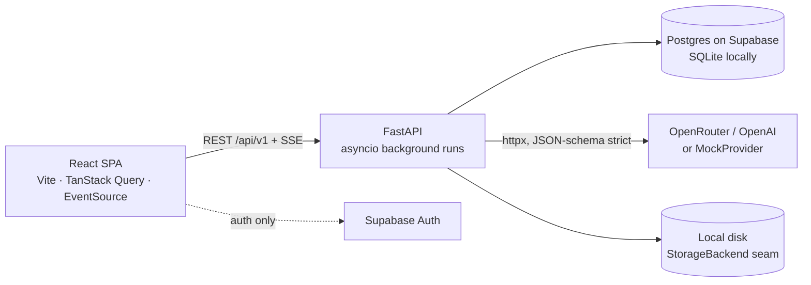

# Faculty Assessment & Curriculum Copilot — End-to-End Summary

> Written for a reader who wants the *why* behind every layer, then the *how* of what was actually built.
> Source of truth for current state remains `PROJECT_CONTEXT.md`; design detail lives in `architecture.md`.

---

## 0. The problem we chose and the shape it forced

**Brief:** AI Build Hackathon final, theme "AI for Academic Life", one day, one team, live demo in front of judges.

**Who we serve:** AUST faculty. Their recurring pain is not "generate content" — it is *checking* their own work: does this exam paper cover every Course Outcome (CO)? Are two questions duplicates of last year's? Are marks fair? Did students actually attain CO4? Do two graders disagree on the same script? Does a new syllabus overlap an existing course?

**The first decision that shaped everything (D-003, D-006):**

1. **AI evaluates, it does not generate.** Judges are told to distrust "slide-only" features and chatbots. An auditor that produces *evidence-backed findings* a human accepts or dismisses is defensible; a generator is not.
2. **Faculty decide, AI advises.** Every finding has `rationale` + `evidence_snippet` and a `status` of `open | accepted | dismissed`. Nothing is auto-applied.
3. **All arithmetic is deterministic code.** Coverage %, attainment %, marks totals, item-analysis, grader divergence, cosine similarity — none of it comes from an LLM. The LLM only *classifies* (question → CO, Bloom level), *confirms* (is this really a duplicate?), and *explains*. This is the single most important design rule: the numbers must be reproducible and hand-verifiable, or the whole "trust" story collapses.

From these three came the product: **one shared Course workspace** (syllabus + COs + CO→PO map) reused by **four modules**, built in risk order and each droppable on demo day:

| Order | Module | What it audits |
|---|---|---|
| P1 | Exam Paper Auditor | CO coverage, Bloom balance, marks fairness, near-duplicates vs past papers |
| P4 | CO–PO Attainment Analyst | Marks sheet → per-CO/PO attainment vs targets |
| P3 | Syllabus Overlap/Gap Analyzer | Draft syllabus vs comparison courses |
| P2 | Grading Consistency Calibrator | Rubric + typed answers × ≥2 graders → divergence + AI pre-score |

P1 first because it is the richest demo with the least data-prep risk; P2 last because typed answer sets are the hardest data to get right.

---

## 1. Process: how we worked before writing code

### 1.1 One file as the shared brain (D-001, D-002)
Multiple AI agents (Copilot, Claude, Cursor) and humans would touch the repo. Context loss between sessions is the #1 hackathon failure mode. So:
- `PROJECT_CONTEXT.md` is the *only* place project knowledge lives — stack, structure, run commands, decisions (`D-NNN`), conventions, known issues, changelog.
- `AGENTS.md`, `CLAUDE.md`, `.github/copilot-instructions.md` are deliberately thin: "read `PROJECT_CONTEXT.md` first, update it when done."

### 1.2 Requirements locked before architecture (§12 of PROJECT_CONTEXT)
We enumerated every requirement with an ID (`REQ-F-001`, `F-101`…, `AI-001`…, `SEC-001`…), split into Core / P1–P4 / Admin / non-functional, and explicit **non-goals** (no student views, no LMS, no OCR, no chatbot, no fine-tuning). Non-goals were as valuable as goals — they let us reject scope creep during the "merge audit" later (D-017).

### 1.3 Architecture document with ADRs (`architecture.md`, 45 sections, 20 ADRs)
Written as if for three parallel engineers (FE / BE / DB) with an ownership matrix, contracts between them (`openapi.json`, `models.py`), a file-by-file plan and a requirement traceability matrix. Even though the team was smaller, this structure let AI agents work in parallel without stepping on each other.

### 1.4 Adversarial reviews baked in
- `edge_cases.md` — ~365 test cases across 17 sections, derived from requirements *before* implementation, including hand-verifiable fixtures for coverage / attainment / calibration / duplicates.
- Multi-agent DB review (security / integrity / pragmatist) → ADR-19: RLS hardening, `run_inputs` redesign, `normalize_qnum`, IDENTITY columns.
- Merge audit against an external "versioned assessment platform" design → ADR-13 / D-017: we *adopted* provenance columns (cheap, huge defensibility win) and *rejected* paper/CLO versioning tables, SIS, blind grading (violate non-goals, add the only partition-scale table).
- `docs/multiagentOrchas.md` — the QA loop: after implementation, independent sub-agents (functional, edge, security, UX, integration, regression, E2E) score /10 with evidence; fix and re-run until ≥ 9/10.

### 1.5 Tiered build (D-008)
T0 auth + workspace + ingestion + P1 + findings + seed → T1 P4/P3/P2 + export → T2 SSE/Bangla/admin → T3 dashboard/compare. The rule: any tier must be droppable without touching lower tiers. This is why every module is a self-contained `modules/<name>/graph.py` registered in a `PIPELINES` dict.

---

## 2. Architecture: why a modular monolith (D-011, ADR-01)



**Why not microservices / queues / Redis / Celery?** One day, one team, one demo machine. Every extra process is a thing that can fail on venue Wi-Fi. Background analysis runs are plain `asyncio` tasks inside the one uvicorn worker; progress is written to a `run_events` table and streamed over **SSE** (ADR-04, ADR-10). The seam for a real queue is a single method — `RunOrchestrator.enqueue()` — so it can be swapped later without touching modules.

**Why FastAPI + Python?** Python owns the AI/data ecosystem (pypdf, python-docx, numeric code), pydantic gives us JSON-schema validation of LLM output for free, and async I/O suits many concurrent LLM/DB calls.

**Why React + Vite SPA?** Fastest path to a polished UI with shadcn/ui + Tailwind, deployed as static files on Vercel (D-026). Supabase JS is used *only* for auth; all data goes through our API so authorization has one enforcement point.

**Why "no LangChain / LangGraph" (D-018, ADR-20)?** The architecture initially proposed LangGraph. In implementation we dropped it: our "graphs" are linear stage lists with a shared `RunContext`, the dependency surface on Python 3.14 was risky, and a 200-line `structured_call` over httpx gave us tighter control of retries, response-format ladders and usage logging than the framework would.

---

## 3. Database: the decisions and their reasons

### 3.1 Postgres on Supabase, SQLite locally (D-004, D-019, D-020)
- **Supabase** was chosen because it bundles Postgres + Auth + Storage + pgvector — the cheapest way to get login and vector search in one day.
- **Reality check:** the dev machine had no Postgres/Docker, and the free-tier Supabase project *paused* mid-build (pooler SSL handshakes hung). So we made the ORM **portable**: dev and tests run on SQLite via `aiosqlite`, prod on Postgres via `asyncpg`, from one `models.py`.
- Portability rules that fell out of this: enums stored as `varchar(32)` (not native enums), `JSON().with_variant(JSONB)`, `Uuid` type, embeddings as JSON float lists. Duplicate detection is in-Python cosine over stored embeddings rather than pgvector — at course scale (tens of questions × a few papers) O(n·m) is microseconds, so pgvector was deferred without loss.

### 3.2 Alembic over hand-written SQL (D-019 supersedes D-013 / ADR-03)
The architecture assigned SQL-file migrations to a DB engineer (`database/migrations/*.sql`, 12 files, with RLS, functions, views). When one team owned both ORM and schema, keeping two sources in sync was pure overhead. Alembic autogenerate from `models.py` made the ORM the single writer. The SQL files remain as the reference design for the full-Supabase target (RLS, `SECURITY DEFINER` functions, `co_po_attainment` view).

### 3.3 Findings are rows, not blobs (D-005, D-016, ADR-07)
A finding is `type, severity, title, rationale, evidence_snippet, target_kind/target_id/target_label, payload, provenance, status, decided_by, decided_at`. Rows enable accept/dismiss, filtering, export of *accepted only*, admin roll-ups and run-vs-run diff. Module-level aggregates (coverage %, Bloom distribution) live in `runs.summary` jsonb because they are shaped differently per module.

### 3.4 Provenance / copy-at-write (D-017, ADR-13)
`runs.context_snapshot`, `runs.model`, `runs.prompt_versions`, `findings.provenance`, `questions.embedding_model`. A finding must still be explainable after the faculty edits the CO list or the prompt changes. This was the cheapest defensibility feature we adopted from the merge audit.

### 3.5 Authorization model (D-012, D-020, D-021, ADR-11)
- Target design: role in `profiles.role` (never JWT claims), backend connects as `app_backend` (NOBYPASSRLS) and runs `SET LOCAL app.user_id/app.role` per transaction; RLS enforces.
- Shipped for the hackathon: RLS deferred; **ownership enforced in the service layer** — `get_owned_course()` returns 404 (not 403) for non-owners so existence is never leaked. Roles + `role_permissions` table + `require_permission()` dependency guard admin routes; admins are read-only over faculty data (SEC-009).

### 3.6 Schema (24 tables, 3 Alembic revisions)
`profiles, role_permissions, courses, program_outcomes, course_outcomes, co_po_map, topics, artefacts, questions, marks_columns, marks_rows, rubric_criteria, answers, question_co_map, question_topic_map, runs, run_inputs, run_events, findings, usage_logs, attainment_results, answer_prescores` (+ `co_po_attainment` view in the SQL design). Conventions: snake_case plural tables, uuid PKs, `created_at/updated_at`, explicit `ON DELETE`, soft-delete on courses with a filtered unique index.

### 3.7 Gotchas that became rules
- Supabase transaction pooler (6543): `SET LOCAL` only, asyncpg `statement_cache_size=0` (also in `alembic/env.py`).
- SQLite is single-writer: `RunContext.emit/warn` write `run_events` in their own short transaction; never emit while another write session is open (caused `database is locked` → run `failed`).
- Never mutate ORM objects after `commit()` in a request when a background task owns the row (the request's final commit clobbered the task's status once).

---

## 4. Ingestion & extraction: turning documents into structured rows

**Why a confirm/edit step (F-012)?** LLM extraction is good, not perfect. Faculty see extracted questions, marks and CO map, fix them, and *then* run analysis. This makes downstream stats trustworthy and makes the human the owner of the ground truth (ADR-17: P1 coverage/overweight/fairness are computed from the faculty-confirmed `question_co_map`).

**Implementation (`artefacts/`, `extraction/`):**
- Upload or paste: PDF/DOCX/TXT/CSV/XLSX, **magic-byte** validated (not just extension), size-capped by `MAX_UPLOAD_MB`, server-generated storage paths behind a `StorageBackend` seam (local disk now, Supabase Storage later — D-022).
- Parsers: pypdf / python-docx / heuristic question splitters; scanned PDFs are rejected with a "paste text" prompt (no OCR — non-goal).
- Extraction runs as a background task with status `pending → extracting → done | failed`, per artefact kind: question paper → questions + marks + CO/Bloom hints; syllabus → topics; marks sheet → columns + anonymised student rows; rubric → criteria + levels; answer set → answers + grader scores.
- Every document fed to the LLM is wrapped by `ai/guard.wrap_untrusted()` — delimited and labelled as untrusted content so instructions inside a PDF cannot hijack the prompt (SEC-001).

---

## 5. The AI layer: designed for reliability, not cleverness

### 5.1 Principles (AI-001…AI-004, D-006, D-007, D-014)
1. **Structured output only.** Every call has a Pydantic schema → JSON Schema, requested with `response_format=json_schema` (strict).
2. **Retry once, then degrade to `partial`.** An LLM stage failure never kills deterministic findings.
3. **Rationale on every output.** Schemas include `rationale`; findings include `evidence_snippet`.
4. **Deterministic arithmetic.** Numbers come from `stats.py`, never from the model.
5. **Vendor-agnostic via one adapter.** `LLM_PROVIDER ∈ {openrouter, openai, mock}`; switching is env-only (ADR-05). OpenRouter was chosen primary for model fallback breadth; OpenAI direct for reliability; models pinned per ADR-14.

### 5.2 `ai/client.structured_call` — the one door to any model
```
build provider → strictify schema → semaphore(4) + circuit breaker
→ response-mode ladder: json_schema → json_object → schema-in-prompt
→ tolerant JSON parse (fences, smart quotes, trailing commas)
→ Pydantic validate → on failure: one "repair turn" (return corrected JSON only)
→ retry once on validation/parse error; jittered backoff on transient transport errors
→ fallback models (LLM_FALLBACK_MODELS) on non-retryable failure
→ write usage_logs (tokens_in/out, latency, status) → StructuredResult
```
Design notes:
- Temperature 0, 60 s hard timeout, **27 s run deadline** with per-call budget `min(12, remaining − 2)` s (ADR-16, `ai/budget.py`) so a run always answers inside the NF-003 30 s target.
- The **response-mode ladder** exists because "OpenAI-compatible" providers differ in which `response_format` they honour; degrading gracefully beats failing.
- `usage_logs` per call powers the admin cost view (F-033) and lets us watch quota during the pitch.
- Document text and tokens are never logged.

### 5.3 Embeddings (D-015, ADR-06)
`text-embedding-3-small`, 1536-d, cosine. Stored as JSON lists; `embedding_model` recorded per row so a model change invalidates comparisons honestly.

### 5.4 `MockProvider` — an offline fallback that does not lie (D-023)
Venue Wi-Fi and API quota are the two things most likely to break a live demo. Rather than canned JSON, the mock uses **deterministic lexical heuristics**: stemmed token overlap for question→CO mapping, a verb→Bloom lookup table, hashed bag-of-words embeddings. It is selected *only* by `LLM_PROVIDER=mock`, and it still reproduces the planted flaws (CO6 uncovered, 58 vs 60 marks, 3 duplicate pairs). Tests can `queue()` raw or invalid responses to exercise every failure path. An `llm_cache` keyed on canonical input (ADR-18) is the planned second layer of offline safety.

### 5.5 Prompts
Live in `*/prompts.py` beside the module with `PROMPT_VERSIONS`, recorded into `runs.prompt_versions`. Bangla/mixed-script text is passed through unchanged (NF-006).

---

## 6. Module pipelines: how each analysis actually runs

All modules share `modules/base.py`: `RunContext` (emit/warn → `run_events`, deadline), `FindingDraft`, `StageFailed`. A pipeline is a list of stages; deterministic stages run even if LLM stages fail.

### P1 `exam_audit`
1. `load_inputs` — draft paper, past papers, COs, topics (deterministic).
2. `embed_questions` — embeddings endpoint (mock: hashed BoW).
3. `map_and_bloom` — LLM maps question → CO with confidence + Bloom level; **faculty mappings override AI**.
4. `find_duplicates` — cosine over embeddings → candidate pairs → LLM confirms overlap.
5. `compute_stats` — coverage %, uncovered/over-weighted COs, Bloom distribution, marks total vs `declared_total_marks`, item analysis (p, D) — deterministic.
6. `persist` — findings of type `uncovered | overweight | bloom_imbalance | marks_fairness | marks_total_mismatch | duplicate`.

### P4 `attainment`
Extract marks → `compute_co_attainment()` (deterministic per-CO %, students, met vs target) → PO roll-up via `co_po_map` strengths → LLM explanation + suggested actions. Numbers into `attainment_results`.

### P3 `syllabus_check`
Load proposal + comparison courses → overlap matrix (deterministic topic similarity) → LLM gap / prerequisite / repositioning notes.

### P2 `calibration`
Load rubric + answers + grader scores → validate `score ≤ max_score` (cannot be a DB CHECK across artefacts → `409 SCORES_EXCEED_RUBRIC`) → divergence per criterion (deterministic) → LLM pre-score with rationale into `answer_prescores` → rubric v2 proposal.

### Run lifecycle (`runs/`)
`POST /courses/{id}/runs` with an idempotency key → `RunOrchestrator.enqueue()` spawns `asyncio` task `run:{id}` → stages write `run_events (seq, stage, pct, level)` → client subscribes to SSE `/runs/{id}/events` (0.7 s poll of the table, terminal heartbeat) → `GET /runs/{id}/findings` → accept/dismiss/reopen → `GET /runs/{id}/export` renders Markdown (PDF via WeasyPrint deferred: needs system libs). On restart, in-flight runs are marked `failed` at startup — honest over stuck.

---

## 7. Auth: three modes, one enforcement point (D-018, D-021, D-028)

| `AUTH_MODE` | Purpose | Mechanism |
|---|---|---|
| `dev` | tests, quick local | fixed `DEV_USER_EMAIL`; `X-Dev-User` header to simulate other users in isolation tests |
| `local` | offline demo | `POST /auth/login` (PBKDF2 hashes in `profiles.password_hash`) → HS256 JWT in `sessionStorage` → `Bearer` |
| `supabase` | production | Supabase Auth JWT verified in Python: ES256/RS256 via JWKS (`PyJWT` + `PyJWKClient`), HS256 legacy secret fallback, `alg` read from header, `none` rejected; profile upserted from claims |

Why keep verification in Python rather than adopting Supabase's Node helpers: the backend is FastAPI, and one verifier means one place to audit. `local` mode exists because the demo must work if Supabase is paused or the venue blocks it. Frontend `VITE_AUTH_MODE` must match.

Other security controls: keys server-side only (SEC-002), upload allow-list/size cap (SEC-003), no raw HTML rendering of LLM output (SEC-004), per-user in-memory rate limiter (SEC-006), anonymised `student_anon_id` everywhere (SEC-007), error envelope `{error:{code,message,details,request_id}}` + `X-Request-Id` on every response.

---

## 8. Frontend: an `Api` seam so UI never waits on the backend

- `lib/api/types.ts` defines the `Api` interface; `HttpApi` talks to `/api/v1`, `MockApi` serves the same shapes locally. `VITE_API_MODE=live|mock`. This let the whole UI (all §12 pages, loading/empty/error states, finding workflow, SSE progress bar, exports, admin panel) be built and smoke-tested before the backend was reachable.
- `useSSE()` wraps native `EventSource` for run progress; TanStack Query owns server state; RHF + zod owns forms.
- Routes: `/` landing · `/login` · `/courses`, `/courses/:id` · `/courses/:id/{exam-audit|attainment|syllabus|calibration}/new` and `/:runId` · `/courses/:id/exam-audit/compare` · `/dashboard` · `/admin/{users,runs,usage,seed,department}` with `RequireAuth` / `RequireRole` guards.
- Design system (`design-system/faculty-copilot/MASTER.md`): tokens for trust/severity, light + dark, a11y; landing uses a dedicated light-blue `--brand` token (D-025) so amber `--accent` stays reserved for in-app decisions.

---

## 9. Demo data: on the critical path, treated like code

`data/seed-data/` — 63 tables, one course (CSE 3103 DBMS, 6 COs), 2 past papers, 1 draft paper, marks CSV, rubric, 6 typed answers × 2 graders — with **25 planted flaws** documented in `_manifest.json`: 58 vs 60 marks, CO6 uncovered, 3 duplicate pairs (0.94/0.87/0.81), Bloom skew (48 % lower-order), CO4/CO5 failing two sessions, Q1a too easy (D = 0.1), ANS-03/ANS-05 grader divergence tracing to criterion R3, CSE 4109 overlapping CSE 4101 by 66.7 %.

`POST /demo/seed` loads it into the current user's workspace in one click (NF-004); the **draft paper is deliberately left un-mapped** so the AI stage is real in front of judges, while past papers carry archived CO tags as faculty ground truth. `POST /admin/seed/reset` restores it. Because the flaws are known in advance, the test suite and the QA loop can assert that the pipeline *finds* them.

---

## 10. Testing & QA

- Backend: pytest + pytest-asyncio + httpx `ASGITransport` + respx, SQLite + `MockProvider`; 17 test files (API: auth, local auth, courses, artefacts, assistant, runs, tier1, QA regressions; unit: AI client, AI reliability, JWT, stats & parsers). Failure paths use `mock_provider.queue(purpose, raw | Exception)`.
- Frontend: typecheck + Vitest + build green; browser smoke tests of the full flow.
- `edge_cases.md` is the pre-judging checklist; `docs/multiagentOrchas.md` is the loop that re-scores until ≥ 9/10.

---

## 11. Deployment (D-026, D-027)

- **Frontend → Vercel** static SPA: `frontend/vercel.json` (SPA rewrite, immutable asset cache, security headers), Root Directory `frontend`, Node ≥ 20.19. API is cross-origin via `VITE_API_BASE_URL` + backend `CORS_ORIGINS` (rewrites cannot read env, so a proxy would hard-code the host).
- **Backend → Render free tier** via root `render.yaml`: Python 3.12, `alembic upgrade head && uvicorn … --workers 1` (one worker is *required* by in-process runs and the per-process rate limiter), health `/api/v1/health`. Disk is ephemeral → uploads vanish on redeploy; DB rows on Supabase persist. Warm the instance before the pitch (cold start 30–60 s).
- **DB → Supabase** (ap-south-1) via IPv4 shared pooler: 6543 transaction mode for the app, 5432 session mode for migrations.

---

## 12. What we deliberately did *not* build, and why

| Dropped / deferred | Reason |
|---|---|
| Chatbot, content generation | Brief rewards evaluation; generation is not defensible |
| OCR / handwriting | High failure rate, no time; paste-text fallback instead |
| LangChain / LangGraph | Linear stages + own `structured_call` were smaller and more controllable |
| pgvector, RLS, Supabase Storage | Not needed at course scale / single-team hackathon; seams left in place |
| Redis / Celery | Extra processes to fail on venue Wi-Fi; `enqueue()` seam kept |
| Paper/CLO versioning tables, SIS, blind grading | Violate non-goals, add scale/complexity without demo value |
| PDF export | WeasyPrint system libs; Markdown export ships |

---

## 13. Reading order if you want the detail

1. `PROJECT_CONTEXT.md` — current state, decisions D-001…D-028, run commands, gotchas.
2. `architecture.md` — API contract §19, schema §21, AI architecture §28, ADR-01…ADR-20 §42.
3. `database_implementation_plan.md` + `database/migrations/*.sql` — the full-Supabase target with RLS.
4. `edge_cases.md` — what "done" means before judging.
5. `backend/app/ai/client.py`, `backend/app/modules/exam_audit/graph.py` — the two files that embody the AI philosophy.
6. `data/seed-data/README.md` + `_manifest.json` — the planted flaws the demo must reproduce.
